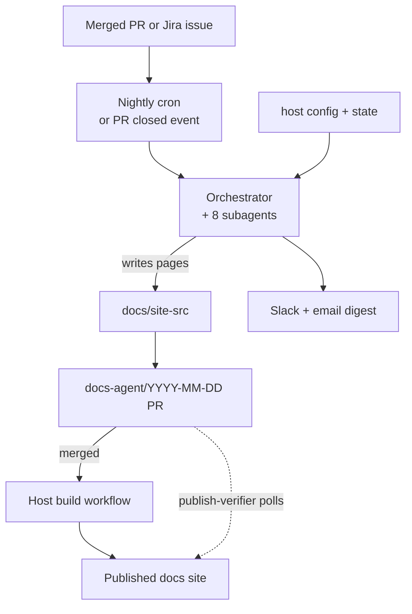
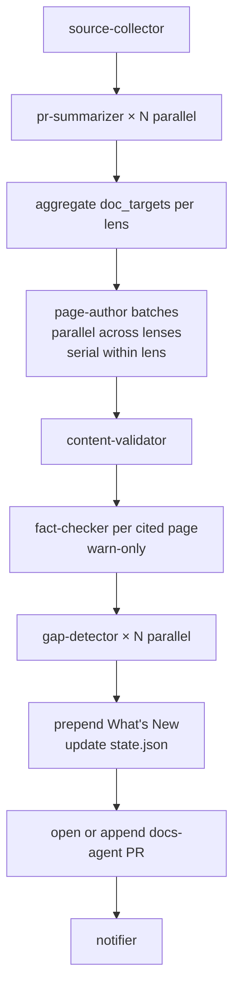
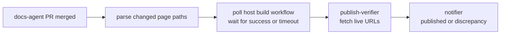

---
description:
  "A Claude Code plugin that turns merged PRs, Jira issues, and commits\
  \ into a nightly docs-update PR \u2014 eight specialized subagents handle voice-matched\
  \ authoring, tiered linting, factual-accuracy checking, gap detection, and post-merge\
  \ publish verification, running against any host repo."
source_files:
  - .claude/hooks/doc_drift.py
  - agents/fact-checker.md
  - docs-agent/*
  - docs/site-src/*
  - docs/site-src/archive/adrs/*.md
  - scripts/lint/<rule>.py
  - scripts/lint/citation_exists.py
  - scripts/lint/frontmatter_schema.py
  - scripts/lint/lint_runner.py
  - scripts/lint/stub_redirect.py
last_reviewed: "2026-08-10"
status: draft
doc_kind: architecture
---

# Engineering Docs Agent

A Claude Code plugin that turns merged PRs, Jira issues, and commits into a nightly docs-update PR — with voice-matched authoring, tiered linting, gap detection, and post-merge publish verification.

The plugin runs against **any host repository**. You install it once, run the setup skill, and get a working nightly pipeline. This repo is simultaneously the plugin's source and its own dogfood host.



## Eight subagents

Each subagent is defined in `agents/<name>.md` with YAML frontmatter declaring its tool allowlist and a JSON schema for its output. The orchestrator (`scripts/orchestrator_runner.py`) dispatches them via the Claude CLI.

| Subagent            | Job                                                                                     | Returns                                        |
| ------------------- | --------------------------------------------------------------------------------------- | ---------------------------------------------- |
| `source-collector`  | Fetches merged PRs in `(last_sha..HEAD)` and optionally linked Jira issues              | `{ prs, jira_issues }`                         |
| `pr-summarizer`     | Summarizes one PR — what changed, why, which doc targets to hit                         | `{ what_changed, why, breaking, doc_targets }` |
| `gap-detector`      | Judges whether a PR needs an ADR/spec/plan that doesn't exist yet                       | `{ needs_spec, reasoning, confidence }`        |
| `page-author`       | Writes or edits one doc page with voice few-shot, grounded in the PRs' source files     | `{ path, diff_summary }`                       |
| `content-validator` | Runs the tiered lint suite on authored pages                                            | `{ passed, failed }`                           |
| `fact-checker`      | Reads a cited page plus its cited sources; flags prose the code contradicts (warn-only) | `{ verdict, findings }`                        |
| `publish-verifier`  | Polls the host build workflow after merge; fetches live URLs to confirm pages are up    | `{ verified, failed }`                         |
| `notifier`          | Posts a Slack message and/or email digest                                               | `{ slack_ok, email_ok, errors }`               |

Subagent outputs are validated against JSON schemas in `agents/schemas/`. Dataclasses in `scripts/contracts.py` provide the typed view used by the orchestrator.

## Main authoring pipeline

The pipeline runs on a cron schedule and on `pull_request.closed` events (excluding `docs-agent/*` branches to prevent recursion).



`pr-summarizer` and `gap-detector` fan out in parallel. `page-author` parallelizes across lenses but serializes within a single lens — two authors must not edit the same page concurrently. The PR open, state write, and notifier steps run serially after fan-in.

After content validation, the `fact-checker` runs once per surviving page that cites at least one resolvable repo source file. It is a warn layer: contradictions render as a "Factual-accuracy warnings" section in the docs PR body and the notifier digest, but never drop a page and never mark the run partial. The one exception is a time-budget cut (CCE-114): when the fact-checker loop passes its deadline, the cut itself records a partial reason (`scripts/orchestrator_runner.py`) — the findings stay advisory, the truncation does not. Pages citing nothing skip the dispatch entirely.

The Actions concurrency group `docs-agent-${branch}` cancels any in-progress run when a newer event fires, acting as a debounce.

## Publish verification pipeline

A separate workflow fires when a `docs-agent/*` PR merges. It runs independently of the authoring pipeline so human review time doesn't block the main run.



## Configuration

The host config lives at `.engineering-docs-agent/config.yml`, scaffolded by the setup skill. Key sections:

```yaml
docs:
  framework: mkdocs
  source_dir: docs/site-src
  whats_new_file: docs/site-src/whats-new.md
  agent_editable_paths:
    - docs/site-src/core/**
    - docs/site-src/archive/**
  lens_paths:
    core: docs/site-src/core
    archive: docs/site-src/archive

sources:
  git:
    host: github
  jira:
    enabled: true
    project_keys: [CCE]
    base_url: https://example.atlassian.net

gap_detection:
  allowlist_paths:
    - scripts/**
  size_filter:
    min_files_changed: 3
```

### Lens paths vs. editable paths

`docs.lens_paths` defines where docs live per lens — the orchestrator reads from these paths for voice loading, gap detection, and PR summarization.

`docs.agent_editable_paths` defines where the agent may write. Any page proposed outside these globs is rejected at runtime.

**Invariant:** every `lens_paths` entry must be covered by at least one `agent_editable_paths` glob. The config loader enforces this at boot via `_validate_lens_paths_are_editable` in `scripts/state_io.py:_validate_lens_paths_are_editable`. A lens with no matching editable glob means the agent reads docs it can never update.

The editable glob may be narrower than the lens path. A lens at `docs/` paired with editable `docs/generated/**` is valid — the agent reads everything under `docs/` but only writes to the `generated/` sub-path.

## State

Runtime state lives in `.engineering-docs-agent/state.json` (gitignored). The most important field is `last_successful_run.head_sha` — the orchestrator uses it to define the `(last_sha..HEAD)` diff window for `source-collector`.

State advances in the same PR as doc changes. If the PR is reverted, the state rolls back with it.

## Voice matching

`page-author` receives voice samples assembled by `scripts/state_io.py:load_voice_samples`, which reads three sources in a fixed order: an optional `docs-agent-voice.md` at the repo root, then every path in `voice.sample_paths` from config, then `CLAUDE.md` if it exists. The whole bundle is capped at 20 KB, so order is precedence — the override leads because it must survive the cap intact. A path reached twice (listing `CLAUDE.md` in `sample_paths` is the common case) is read once. The few-shot approach is intentional: no separate fine-tuning, no stored embeddings.

The `load_voice_samples` helper in `scripts/state_io.py` drives the load order.

## Linting

Lint rules are standalone Python scripts in `scripts/lint/`. Three tiers:

- **Tier 1** — default-on; a failure blocks the page from the PR.
- **Tier 2** — opt-in per rule; also blocks on failure.
- **Tier 3** — advisory; surfaces a warning in the notification but does not drop the page.

The host enables tiers in config. You can run the same scripts in your own CI on human-authored PRs:

```bash
python scripts/lint/lint_runner.py \
  --config .engineering-docs-agent/config.yml \
  --paths docs/**/*.md \
  --json
```

### `citation_exists` blocks the whole page, not the diff

`citation_exists` (`scripts/lint/citation_exists.py:check_path`) is one of the default Tier-1 block rules. It checks every backticked repo path, `path:symbol`, and test identifier in a page's prose against the actual repo tree, so a page that cites code the agent invented never merges.

The rule re-lints a page's **entire** prose on every run, not just the lines the current edit touched. That has a sharp edge: one stale or confabulated citation anywhere on the page latches it shut against every future docs-agent edit. `content-validator` re-fails the page, the edit is dropped from the PR, and the run is marked `partial` — which also disqualifies the run from the CCE-101 auto-merge gate. Two nightly runs (PRs #197 and #201) lost real edits this way before the pattern was diagnosed; CCE-132 cleared six confabulated citations from the published corpus as a docs-only fix, deliberately separate from CCE-134's fix to the lint rule's own metasyntactic-placeholder exemption. See [Capability C — Canonical Core Citations](cce-capability-c-canonical-core-citations.md) for the citation grammar, the `example/` illustrative namespace, and the `lint.citation_exempt_tokens` escape hatch.

## Generic-first design

The plugin is designed to run against arbitrary host repos. Behavior is driven by detection and config, never by hardcoded paths. When a host lacks a convention — no OpenAPI schema, no Jira, no specs directory — the affected capability skips or falls back cleanly. It never errors and never emits an empty artifact.

Detection logic lives in `scripts/setup_discover.py`. The orchestrator reads all path inputs from the `site:` config block and from that discovery output.
