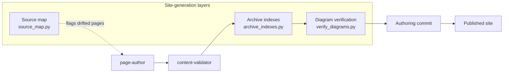

---
description:
  "How the agent produces a navigable docs site by combining a per-run\
  \ code-to-docs source map, frontmatter-driven archive indexes for ADRs/specs/plans,\
  \ and a Mermaid render gate \u2014 each layer driven by config and detection, never\
  \ by hardcoded paths."
source_files:
  - agents/schemas/*.json
  - docs/superpowers/**
  - scripts/source_map.py
  - scripts/archive_indexes.py
  - scripts/verify_diagrams.py
last_reviewed: "2026-05-28"
status: draft
doc_kind: architecture
---

# Structured Docs Site Generation

The engineering-docs-agent produces a structured, navigable docs site by combining three layers: a per-run source map that links code to docs, archive indexes that make ADRs/specs/plans discoverable, and a diagram-verification pass that catches broken visuals before the PR lands.

## Source map

`scripts/source_map.py` resolves each site page's frontmatter `source_files:` globs against the repo's tracked files and emits a dual-view JSON artifact at `<docs_dir>/.doc-source-map.json`: a `map` view from source file path to the pages that cover it, and a `patterns` view from page to its declared globs.

The orchestrator generates this map itself — it does not load a pre-existing one. `scripts/orchestrator_runner.py:compute_source_drift` calls `scripts/source_map.py:generate_source_map`, then hands the result to `scripts/source_drift.py:detect_drift` along with the union of every PR's changed files. Pages whose declared sources changed come back as drifted and are listed under "Pages to review (source drift)" in the docs PR body, so edits land on the pages that already cover a file instead of creating duplicate coverage.

The map is rebuilt on every run. It reads `docs.source_dir` from config to locate the docs tree and scans frontmatter `source_files` lists across all pages. Pages that declare no `source_files` are indexed but resolve to no code path, so a change anywhere in the repo will never flag them as drifted.

## Archive indexes

`scripts/archive_indexes.py` generates the index pages for the archive lens — the listing of ADRs, specs, and plans under `docs/site-src/archive/`. It emits one index page per configured category: date-prefixed `.md` files grouped by ISO month, newest first, each row carrying title, status, and a one-line summary.

The grouping date comes from the filename, not the frontmatter. `scripts/archive_indexes.py:DATE_PREFIX` matches a leading `YYYY-MM-DD-` on each file name; a file without that prefix is skipped. Only `status` is read from the document's frontmatter.

The script runs inside the authoring pipeline, after `page-author` completes. If a newly authored page is placed in the archive, the index is regenerated in the same commit so the listing never drifts out of sync.

Promoted archive pages follow the redirect-stub pattern: the original ADR/spec path retains a three-line stub pointing at its synthesis target, and the index entry links to the promoted location. `scripts/lint/stub_redirect.py` enforces that the stub format is intact on every lint run.

## Diagram verification

Two distinct checks guard diagrams, and they run at different stages against different inputs.

`scripts/lint/diagrams.py` is the Tier-1 `diagrams` lint rule. It validates Mermaid code-fence syntax in the page source, is pure stdlib, and needs no browser. It runs inside the authoring pipeline, so a page whose fence is malformed fails the Tier-1 gate and is dropped from the PR rather than published broken.

`scripts/verify_diagrams.py` is a separate post-build render gate that proves the emitted Mermaid actually renders in the built MkDocs site. It runs in CI after `mkdocs build`, not in the lint pass, and it never participates in the Tier-1 rule set. Its module docstring is explicit that the agent runtime must never import it — Playwright is a docs-tooling dependency held behind a guarded import, and the stdlib agent runtime stays free of it.

The render gate accepts `--site-dir` and `--source-dir` flags so it works against any docs framework layout the host configures. The `diagram-gate` job in `.github/workflows/docs.yml` invokes it with `--require`, which turns a missing Playwright into a hard failure instead of a silent skip.

## Agent schemas

`agents/schemas/*.json` are JSON Schema files that codify the output contract for each subagent. The orchestrator validates subagent responses against these schemas before passing data downstream. A response that fails schema validation is treated like a subagent crash: the run is marked `partial: true` with a `partial_reasons` entry, and the affected steps are skipped.

Schema files are named after the agent they cover, in snake_case with a `.schema.json` suffix (e.g., `agents/schemas/pr_summarizer.schema.json`, `agents/schemas/page_author.schema.json`). Dataclasses in `scripts/contracts.py` mirror the schemas for typed access inside the orchestrator runner. When you add a field to a schema, update the corresponding dataclass and run `python3 -m pytest` to catch any callers that break.

## Specs and plans

`docs/superpowers/specs/` and `docs/superpowers/plans/` hold the design artifacts that drove the agent's implementation. The gap-detector reads this directory to verify that non-trivial PRs have a corresponding spec or plan. If the host repo has no `docs/superpowers/` tree, the gap-detector falls back to checking for any file matching `*spec*` or `*plan*` in the configured `sources.specs_paths` list; if that list is also absent, the detector skips the spec-presence check entirely.

These files are input to the agent but are themselves docs: they are versioned, have frontmatter, and appear in the archive index. The `synthesized_into` frontmatter field links a spec to the architecture page that absorbed it, and the index marks such entries as promoted.
