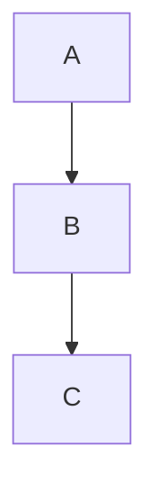

# engineering-docs-agent Implementation Plan

> **For agentic workers:** REQUIRED SUB-SKILL: Use superpowers:subagent-driven-development (recommended) or superpowers:executing-plans to implement this plan task-by-task. Steps use checkbox (`- [ ]`) syntax for tracking.

**Goal:** Build the engineering-docs-agent Claude Code plugin v0.1.0, a subagent-driven nightly docs-PR generator with publish verification and tiered content linting, per the design spec at `docs/superpowers/specs/2026-05-19-engineering-docs-agent-design.md`.

**Architecture:** Approach 3 — a runtime orchestrator skill dispatches 7 specialized subagents (`source-collector`, `pr-summarizer`, `gap-detector`, `page-author`, `content-validator`, `publish-verifier`, `notifier`) through a main authoring pipeline plus a separate post-merge verify pipeline. State lives in a committed `state.json` that advances atomically with the docs PR. Lint rules are standalone Python/Bash scripts hosts can also run independently.

**Tech Stack:** Python 3.11+, Bash, PyYAML, jsonschema, pytest, GitHub Actions, Claude Code plugin format (frontmatter-typed agent and skill markdown files).

---

## Conventions (applies to every task)

**Python style**

- Each script is invocable as a standalone CLI: `python scripts/lint/<rule>.py --config <path> --paths <file>... [--json]`.
- Exit codes: `0` = pass, `1` = block-severity failure, `2` = warn-severity failure.
- When `--json`, scripts write `{ "rule": str, "severity": "block"|"warn", "results": [{"path": str, "ok": bool, "message": str}] }` to stdout and nothing else.
- Use `argparse`. No global state.
- All Python files start with `from __future__ import annotations` and use type hints throughout.

**Testing**

- pytest. Test paths mirror source paths: `scripts/lint/foo.py` → `tests/lint/test_foo.py`.
- Each lint rule test must have at least one known-good fixture and one known-bad fixture.
- Fixtures live in `tests/fixtures/`.

**Commits**

- Conventional commits: `feat(scope):`, `test(scope):`, `fix(scope):`, `chore(scope):`, `docs(scope):`.
- Co-Authored-By trailer per project default.

**Schemas defined inline in this plan**

- `LintResult` JSON: `{ "rule": str, "severity": "block"|"warn", "results": [{"path": str, "ok": bool, "message": str}] }`
- `Config` shape: see spec §5.4.
- `State` shape: see spec §5.5.
- Subagent output schemas: defined per agent in Phase 5.

**Lint rule script template (referenced from Phase 3, 10, 11):**

```python
"""Lint rule: <rule_name>. <one-line description>."""
from __future__ import annotations

import argparse
import json
import sys
from pathlib import Path
from typing import Any

import yaml

RULE_NAME = "<rule_name>"
SEVERITY = "block"  # or "warn"


def load_config(path: Path) -> dict[str, Any]:
    return yaml.safe_load(path.read_text())


def check_path(path: Path, config: dict[str, Any]) -> tuple[bool, str]:
    """Return (ok, message). ok=True means the file passes the rule."""
    # Rule-specific logic goes here.
    raise NotImplementedError


def main() -> int:
    parser = argparse.ArgumentParser(description=__doc__)
    parser.add_argument("--config", type=Path, required=True)
    parser.add_argument("--paths", type=Path, nargs="+", required=True)
    parser.add_argument("--json", action="store_true")
    args = parser.parse_args()

    config = load_config(args.config)
    results = []
    any_failed = False
    for p in args.paths:
        ok, message = check_path(p, config)
        results.append({"path": str(p), "ok": ok, "message": message})
        if not ok:
            any_failed = True

    if args.json:
        json.dump(
            {"rule": RULE_NAME, "severity": SEVERITY, "results": results},
            sys.stdout,
        )
    else:
        for r in results:
            status = "PASS" if r["ok"] else "FAIL"
            print(f"[{status}] {r['path']}: {r['message']}")

    if any_failed:
        return 1 if SEVERITY == "block" else 2
    return 0


if __name__ == "__main__":
    sys.exit(main())
```

**Lint test template (referenced from Phase 3, 10, 11):**

```python
"""Tests for scripts/lint/<rule>.py."""
from __future__ import annotations

import json
import subprocess
import sys
from pathlib import Path

SCRIPT = Path(__file__).parent.parent.parent / "scripts" / "lint" / "<rule>.py"
FIXTURES = Path(__file__).parent.parent / "fixtures" / "<rule>"


def _run(paths: list[Path], config_path: Path) -> tuple[int, dict]:
    result = subprocess.run(
        [sys.executable, str(SCRIPT), "--config", str(config_path), "--paths",
         *[str(p) for p in paths], "--json"],
        capture_output=True, text=True,
    )
    return result.returncode, json.loads(result.stdout)


def test_known_good_passes(tmp_path):
    config = tmp_path / "config.yml"
    config.write_text("docs: {}\nlint: {}\n")
    rc, out = _run([FIXTURES / "good.md"], config)
    assert rc == 0
    assert all(r["ok"] for r in out["results"])


def test_known_bad_fails(tmp_path):
    config = tmp_path / "config.yml"
    config.write_text("docs: {}\nlint: {}\n")
    rc, out = _run([FIXTURES / "bad.md"], config)
    assert rc == 1
    assert any(not r["ok"] for r in out["results"])
```

**Subagent definition template (referenced from Phase 5):**

````markdown
---
name: <agent-name>
description: <one-sentence trigger description>
model: sonnet
tools:
  - Read
  - Bash
---

# <Agent Name>

## Job

<2-3 sentences>

## Inputs

The orchestrator will pass you:

- `<field>`: <description and example>

## Output contract

Return ONLY a JSON object matching this schema:

```json
{
  "<field>": "<type and meaning>"
}
```
````

## Procedure

1. <step>
2. <step>

## Failure handling

If <condition>, return `{"error": "<reason>"}` and exit.

````

---

## Phase 1: Plugin scaffolding

**Goal:** Create the repository layout and plugin manifests so Claude Code can discover the plugin.

### Task 1.1: Create `.claude-plugin/plugin.json`

**Files:**
- Create: `.claude-plugin/plugin.json`

- [ ] **Step 1: Write plugin.json**

```json
{
  "name": "engineering-docs-agent",
  "version": "0.1.0",
  "description": "Nightly docs-PR generator: summarizes engineering changes, updates host docs site, runs lint, opens a PR.",
  "author": "Theo Jungeblut",
  "license": "MIT"
}
````

- [ ] **Step 2: Commit**

```bash
git add .claude-plugin/plugin.json
git commit -m "feat(plugin): add plugin manifest"
```

### Task 1.2: Create `marketplace.json`

**Files:**

- Create: `marketplace.json`

- [ ] **Step 1: Write marketplace.json**

```json
{
  "name": "engineering-docs-agent-marketplace",
  "description": "Self-hosted marketplace for engineering-docs-agent.",
  "plugins": [
    {
      "name": "engineering-docs-agent",
      "source": ".",
      "version": "0.1.0"
    }
  ]
}
```

- [ ] **Step 2: Commit**

```bash
git add marketplace.json
git commit -m "feat(marketplace): add self-hosted marketplace manifest"
```

### Task 1.3: Create directory skeleton

**Files:**

- Create: `agents/.gitkeep`, `skills/.gitkeep`, `templates/.gitkeep`, `scripts/lint/.gitkeep`, `tests/lint/.gitkeep`, `tests/orchestrator/.gitkeep`, `tests/setup/.gitkeep`, `tests/fixtures/.gitkeep`

- [ ] **Step 1: Create directories with .gitkeep placeholders**

```bash
mkdir -p agents skills templates scripts/lint tests/lint tests/orchestrator tests/setup tests/fixtures tests/agents
for d in agents skills templates scripts/lint tests/lint tests/orchestrator tests/setup tests/fixtures tests/agents; do
  touch "$d/.gitkeep"
done
```

- [ ] **Step 2: Commit**

```bash
git add agents skills templates scripts tests
git commit -m "chore: add repository directory skeleton"
```

### Task 1.4: Add `pyproject.toml` for Python tooling

**Files:**

- Create: `pyproject.toml`

- [ ] **Step 1: Write pyproject.toml**

```toml
[project]
name = "engineering-docs-agent"
version = "0.1.0"
description = "Nightly docs-PR generator plugin for Claude Code"
requires-python = ">=3.11"
dependencies = [
  "pyyaml>=6.0",
  "jsonschema>=4.0",
]

[project.optional-dependencies]
dev = [
  "pytest>=7.0",
  "pytest-cov>=4.0",
]

[tool.pytest.ini_options]
testpaths = ["tests"]
python_files = ["test_*.py"]
```

- [ ] **Step 2: Commit**

```bash
git add pyproject.toml
git commit -m "chore: add pyproject.toml with deps and pytest config"
```

---

## Phase 2: Re-create ADIS scripts (footnotes, diagrams, archive indexes)

**Goal:** Implement the validators the spec calls out as "reused from ADIS." Since this repo doesn't have the ADIS source, recreate them per the spec's described behavior.

### Task 2.1: Footnote integrity script

**Files:**

- Create: `scripts/lint/footnotes.sh`
- Create: `tests/fixtures/footnotes/good.md`, `tests/fixtures/footnotes/bad.md`
- Create: `tests/lint/test_footnotes.py`

- [ ] **Step 1: Write known-good fixture**

```markdown
<!-- tests/fixtures/footnotes/good.md -->

# Sample

This has a footnote.[^1]

[^1]: Footnote definition.
```

- [ ] **Step 2: Write known-bad fixture (orphan ref)**

```markdown
<!-- tests/fixtures/footnotes/bad.md -->

# Sample

This has a footnote.[^1]

[^2]: Different definition, orphaned.
```

- [ ] **Step 3: Write the failing test**

```python
# tests/lint/test_footnotes.py
from __future__ import annotations
import json
import subprocess
from pathlib import Path

SCRIPT = Path(__file__).parent.parent.parent / "scripts" / "lint" / "footnotes.sh"
FIXTURES = Path(__file__).parent.parent / "fixtures" / "footnotes"


def _run(paths: list[Path]) -> tuple[int, dict]:
    result = subprocess.run(
        ["bash", str(SCRIPT), "--json", *[str(p) for p in paths]],
        capture_output=True, text=True,
    )
    return result.returncode, json.loads(result.stdout) if result.stdout else {}


def test_good_passes():
    rc, out = _run([FIXTURES / "good.md"])
    assert rc == 0


def test_bad_fails():
    rc, _ = _run([FIXTURES / "bad.md"])
    assert rc == 1
```

- [ ] **Step 4: Run tests to confirm failure**

```bash
pytest tests/lint/test_footnotes.py -v
```

Expected: FAIL — `scripts/lint/footnotes.sh` does not exist.

- [ ] **Step 5: Implement `scripts/lint/footnotes.sh`**

```bash
#!/usr/bin/env bash
# Footnote integrity: every [^n] reference must have a matching [^n]: definition,
# and vice versa.
set -euo pipefail

JSON=0
PATHS=()
while [[ $# -gt 0 ]]; do
  case "$1" in
    --json) JSON=1; shift ;;
    *) PATHS+=("$1"); shift ;;
  esac
done

results_json=""
any_failed=0

for p in "${PATHS[@]}"; do
  refs=$(grep -oE '\[\^[a-zA-Z0-9_-]+\]' "$p" | grep -v ':' | sort -u || true)
  defs=$(grep -oE '^\[\^[a-zA-Z0-9_-]+\]:' "$p" | sed 's/:$//' | sort -u || true)
  orphan_refs=$(comm -23 <(echo "$refs") <(echo "$defs"))
  orphan_defs=$(comm -13 <(echo "$refs") <(echo "$defs"))

  if [[ -z "$orphan_refs" && -z "$orphan_defs" ]]; then
    ok=true; msg="ok"
  else
    ok=false; any_failed=1
    msg="orphan refs: ${orphan_refs:-none}; orphan defs: ${orphan_defs:-none}"
  fi

  esc_msg=$(printf '%s' "$msg" | python3 -c 'import json,sys; print(json.dumps(sys.stdin.read()))')
  results_json="${results_json}{\"path\":\"$p\",\"ok\":$ok,\"message\":$esc_msg},"
done

results_json="[${results_json%,}]"
if [[ $JSON -eq 1 ]]; then
  echo "{\"rule\":\"footnotes\",\"severity\":\"block\",\"results\":$results_json}"
fi
exit $any_failed
```

- [ ] **Step 6: `chmod +x scripts/lint/footnotes.sh`**

```bash
chmod +x scripts/lint/footnotes.sh
```

- [ ] **Step 7: Run tests to confirm passing**

```bash
pytest tests/lint/test_footnotes.py -v
```

Expected: PASS.

- [ ] **Step 8: Commit**

```bash
git add scripts/lint/footnotes.sh tests/lint/test_footnotes.py tests/fixtures/footnotes/
git commit -m "feat(lint): footnote integrity validator with tests"
```

### Task 2.2: Diagram verifier (Mermaid syntax check)

**Files:**

- Create: `scripts/lint/diagrams.py`
- Create: `tests/fixtures/diagrams/good.md`, `tests/fixtures/diagrams/bad.md`
- Create: `tests/lint/test_diagrams.py`

> Scope note: full Playwright rendering is deferred. v0.1 validates Mermaid code-fence syntax only via Mermaid's CLI when available; falls back to a structural regex parse when it isn't. Logged as a follow-up in spec §13.

- [ ] **Step 1: Write known-good fixture**

````markdown
<!-- tests/fixtures/diagrams/good.md -->

# Sample


````

````

- [ ] **Step 2: Write known-bad fixture (unterminated fence)**

```markdown
<!-- tests/fixtures/diagrams/bad.md -->
# Sample

```mermaid
graph TD
  A --> B
````

- [ ] **Step 3: Write the failing test**

```python
# tests/lint/test_diagrams.py
from __future__ import annotations
import json
import subprocess
import sys
from pathlib import Path

SCRIPT = Path(__file__).parent.parent.parent / "scripts" / "lint" / "diagrams.py"
FIXTURES = Path(__file__).parent.parent / "fixtures" / "diagrams"


def _run(paths: list[Path], cfg: Path) -> tuple[int, dict]:
    r = subprocess.run(
        [sys.executable, str(SCRIPT), "--config", str(cfg), "--paths",
         *[str(p) for p in paths], "--json"],
        capture_output=True, text=True,
    )
    return r.returncode, json.loads(r.stdout)


def test_good_passes(tmp_path):
    cfg = tmp_path / "c.yml"; cfg.write_text("{}")
    rc, out = _run([FIXTURES / "good.md"], cfg)
    assert rc == 0


def test_bad_fails(tmp_path):
    cfg = tmp_path / "c.yml"; cfg.write_text("{}")
    rc, _ = _run([FIXTURES / "bad.md"], cfg)
    assert rc == 1
```

- [ ] **Step 4: Run tests to confirm failure**

```bash
pytest tests/lint/test_diagrams.py -v
```

Expected: FAIL.

- [ ] **Step 5: Implement `scripts/lint/diagrams.py`** (uses the lint rule script template; replace `check_path`)

````python
"""Lint rule: diagrams. Validates Mermaid code-fence syntax."""
from __future__ import annotations
import argparse, json, re, sys
from pathlib import Path
from typing import Any
import yaml

RULE_NAME = "diagrams"
SEVERITY = "block"

MERMAID_FENCE = re.compile(r"^```mermaid\s*$", re.MULTILINE)
FENCE_END = re.compile(r"^```\s*$", re.MULTILINE)


def load_config(path: Path) -> dict[str, Any]:
    return yaml.safe_load(path.read_text()) or {}


def check_path(path: Path, config: dict[str, Any]) -> tuple[bool, str]:
    text = path.read_text()
    starts = [m.start() for m in MERMAID_FENCE.finditer(text)]
    if not starts:
        return True, "no mermaid blocks"
    # For each mermaid fence, find the next closing fence.
    cursor = 0
    for s in starts:
        end_match = FENCE_END.search(text, pos=s + len("```mermaid"))
        if not end_match:
            return False, f"unterminated mermaid fence at offset {s}"
        cursor = end_match.end()
    return True, f"{len(starts)} mermaid block(s) ok"


def main() -> int:
    parser = argparse.ArgumentParser(description=__doc__)
    parser.add_argument("--config", type=Path, required=True)
    parser.add_argument("--paths", type=Path, nargs="+", required=True)
    parser.add_argument("--json", action="store_true")
    args = parser.parse_args()
    config = load_config(args.config)
    results, any_failed = [], False
    for p in args.paths:
        ok, message = check_path(p, config)
        results.append({"path": str(p), "ok": ok, "message": message})
        if not ok:
            any_failed = True
    if args.json:
        json.dump({"rule": RULE_NAME, "severity": SEVERITY, "results": results}, sys.stdout)
    return 1 if any_failed else 0


if __name__ == "__main__":
    sys.exit(main())
````

- [ ] **Step 6: Run tests to confirm passing**

```bash
pytest tests/lint/test_diagrams.py -v
```

- [ ] **Step 7: Commit**

```bash
git add scripts/lint/diagrams.py tests/lint/test_diagrams.py tests/fixtures/diagrams/
git commit -m "feat(lint): mermaid diagram syntax validator with tests"
```

### Task 2.3: Archive-index generator

**Files:**

- Create: `scripts/archive_indexes.py`
- Create: `tests/orchestrator/test_archive_indexes.py`
- Create: `tests/fixtures/archive_indexes/` with sample tree

- [ ] **Step 1: Build the fixture tree**

```bash
mkdir -p tests/fixtures/archive_indexes/archive/adrs tests/fixtures/archive_indexes/archive/specs
cat > tests/fixtures/archive_indexes/archive/adrs/2026-01-01-foo.md <<'EOF'
---
status: accepted
sources: []
synthesized_into: []
---
# Foo
EOF
cat > tests/fixtures/archive_indexes/archive/specs/2026-01-02-bar.md <<'EOF'
---
status: draft
sources: []
synthesized_into: []
---
# Bar
EOF
```

- [ ] **Step 2: Write the failing test**

```python
# tests/orchestrator/test_archive_indexes.py
from __future__ import annotations
import subprocess, sys
from pathlib import Path

SCRIPT = Path(__file__).parent.parent.parent / "scripts" / "archive_indexes.py"
FIXTURES = Path(__file__).parent.parent / "fixtures" / "archive_indexes"


def test_generates_indexes(tmp_path):
    # Copy fixture into tmp_path so generated files don't pollute the repo.
    import shutil
    target = tmp_path / "archive_indexes"
    shutil.copytree(FIXTURES, target)
    subprocess.run(
        [sys.executable, str(SCRIPT), "--archive-root", str(target / "archive")],
        check=True,
    )
    assert (target / "archive" / "adrs" / "index.md").exists()
    assert (target / "archive" / "specs" / "index.md").exists()
```

- [ ] **Step 3: Run to confirm failure**

```bash
pytest tests/orchestrator/test_archive_indexes.py -v
```

- [ ] **Step 4: Implement `scripts/archive_indexes.py`**

```python
"""Generate index.md per archive subdirectory."""
from __future__ import annotations
import argparse, sys
from pathlib import Path

import yaml


def parse_frontmatter(p: Path) -> dict:
    text = p.read_text()
    if not text.startswith("---"):
        return {}
    parts = text.split("---", 2)
    if len(parts) < 3:
        return {}
    return yaml.safe_load(parts[1]) or {}


def build_index(subdir: Path) -> str:
    entries = []
    for md in sorted(subdir.glob("*.md")):
        if md.name == "index.md":
            continue
        fm = parse_frontmatter(md)
        title = md.stem
        status = fm.get("status", "—")
        entries.append(f"- [{title}]({md.name}) — status: `{status}`")
    return f"# {subdir.name}\n\n" + "\n".join(entries) + "\n"


def main() -> int:
    parser = argparse.ArgumentParser()
    parser.add_argument("--archive-root", type=Path, required=True)
    args = parser.parse_args()
    for sub in args.archive_root.iterdir():
        if sub.is_dir():
            (sub / "index.md").write_text(build_index(sub))
    return 0


if __name__ == "__main__":
    sys.exit(main())
```

- [ ] **Step 5: Run tests to confirm passing**

```bash
pytest tests/orchestrator/test_archive_indexes.py -v
```

- [ ] **Step 6: Commit**

```bash
git add scripts/archive_indexes.py tests/orchestrator/test_archive_indexes.py tests/fixtures/archive_indexes/
git commit -m "feat(scripts): archive-index generator with tests"
```

---

## Phase 3: Tier 1 lint rules (parallelizable across tasks)

**Goal:** Implement the five default-on, block-severity lint rules per spec §6.1. Each follows the lint rule script template. These tasks are independent and may be dispatched in parallel.

### Task 3.1: `frontmatter_schema` rule

**Files:**

- Create: `scripts/lint/frontmatter_schema.py`
- Create: `tests/fixtures/frontmatter_schema/good.md`, `tests/fixtures/frontmatter_schema/bad_missing_field.md`, `tests/fixtures/frontmatter_schema/bad_no_frontmatter.md`
- Create: `tests/lint/test_frontmatter_schema.py`

- [ ] **Step 1: Write fixtures**

`good.md`:

```markdown
---
status: accepted
sources: [foo, bar]
synthesized_into: []
---

# Title
```

`bad_missing_field.md`:

```markdown
---
status: accepted
sources: [foo]
---

# Title
```

`bad_no_frontmatter.md`:

```markdown
# Title

No frontmatter here.
```

- [ ] **Step 2: Write failing test**

```python
# tests/lint/test_frontmatter_schema.py
from __future__ import annotations
import json, subprocess, sys
from pathlib import Path

SCRIPT = Path(__file__).parent.parent.parent / "scripts" / "lint" / "frontmatter_schema.py"
FIX = Path(__file__).parent.parent / "fixtures" / "frontmatter_schema"


def _run(paths, cfg):
    r = subprocess.run(
        [sys.executable, str(SCRIPT), "--config", str(cfg), "--paths",
         *[str(p) for p in paths], "--json"],
        capture_output=True, text=True,
    )
    return r.returncode, json.loads(r.stdout)


def test_good(tmp_path):
    cfg = tmp_path / "c.yml"; cfg.write_text("{}")
    rc, _ = _run([FIX / "good.md"], cfg)
    assert rc == 0


def test_missing_field(tmp_path):
    cfg = tmp_path / "c.yml"; cfg.write_text("{}")
    rc, out = _run([FIX / "bad_missing_field.md"], cfg)
    assert rc == 1
    assert "synthesized_into" in out["results"][0]["message"]


def test_no_frontmatter(tmp_path):
    cfg = tmp_path / "c.yml"; cfg.write_text("{}")
    rc, _ = _run([FIX / "bad_no_frontmatter.md"], cfg)
    assert rc == 1
```

- [ ] **Step 3: Implement (use the lint rule script template)**

```python
"""Lint rule: frontmatter_schema. Validates required YAML frontmatter fields."""
from __future__ import annotations
import argparse, json, sys
from pathlib import Path
from typing import Any
import yaml

RULE_NAME = "frontmatter_schema"
SEVERITY = "block"
REQUIRED_FIELDS = ("status", "sources", "synthesized_into")


def load_config(path: Path) -> dict[str, Any]:
    return yaml.safe_load(path.read_text()) or {}


def parse_frontmatter(text: str) -> dict | None:
    if not text.startswith("---"):
        return None
    parts = text.split("---", 2)
    if len(parts) < 3:
        return None
    try:
        return yaml.safe_load(parts[1]) or {}
    except yaml.YAMLError:
        return None


def check_path(path: Path, config: dict[str, Any]) -> tuple[bool, str]:
    fm = parse_frontmatter(path.read_text())
    if fm is None:
        return False, "no frontmatter or YAML parse error"
    missing = [f for f in REQUIRED_FIELDS if f not in fm]
    if missing:
        return False, f"missing required field(s): {', '.join(missing)}"
    return True, "ok"


def main() -> int:
    parser = argparse.ArgumentParser(description=__doc__)
    parser.add_argument("--config", type=Path, required=True)
    parser.add_argument("--paths", type=Path, nargs="+", required=True)
    parser.add_argument("--json", action="store_true")
    args = parser.parse_args()
    config = load_config(args.config)
    results, any_failed = [], False
    for p in args.paths:
        ok, message = check_path(p, config)
        results.append({"path": str(p), "ok": ok, "message": message})
        if not ok:
            any_failed = True
    if args.json:
        json.dump({"rule": RULE_NAME, "severity": SEVERITY, "results": results}, sys.stdout)
    return 1 if any_failed else 0


if __name__ == "__main__":
    sys.exit(main())
```

- [ ] **Step 4: Run tests**

```bash
pytest tests/lint/test_frontmatter_schema.py -v
```

- [ ] **Step 5: Commit**

```bash
git add scripts/lint/frontmatter_schema.py tests/lint/test_frontmatter_schema.py tests/fixtures/frontmatter_schema/
git commit -m "feat(lint): frontmatter schema validator with tests"
```

### Task 3.2: `internal_links` rule

**Files:**

- Create: `scripts/lint/internal_links.py`
- Create: `tests/fixtures/internal_links/good.md`, `tests/fixtures/internal_links/bad_broken.md`, `tests/fixtures/internal_links/target.md`
- Create: `tests/lint/test_internal_links.py`

- [ ] **Step 1: Write fixtures**

`target.md`:

```markdown
# Target
```

`good.md`:

```markdown
# Good

[Link to target](target.md)
```

`bad_broken.md`:

```markdown
# Bad

[Link to missing](does-not-exist.md)
```

- [ ] **Step 2: Write failing test**

```python
# tests/lint/test_internal_links.py
from __future__ import annotations
import json, subprocess, sys
from pathlib import Path

SCRIPT = Path(__file__).parent.parent.parent / "scripts" / "lint" / "internal_links.py"
FIX = Path(__file__).parent.parent / "fixtures" / "internal_links"


def _run(paths, cfg):
    r = subprocess.run(
        [sys.executable, str(SCRIPT), "--config", str(cfg), "--paths",
         *[str(p) for p in paths], "--json"],
        capture_output=True, text=True,
    )
    return r.returncode, json.loads(r.stdout)


def test_good(tmp_path):
    cfg = tmp_path / "c.yml"; cfg.write_text("{}")
    rc, _ = _run([FIX / "good.md"], cfg)
    assert rc == 0


def test_broken(tmp_path):
    cfg = tmp_path / "c.yml"; cfg.write_text("{}")
    rc, out = _run([FIX / "bad_broken.md"], cfg)
    assert rc == 1
    assert "does-not-exist.md" in out["results"][0]["message"]
```

- [ ] **Step 3: Implement**

```python
"""Lint rule: internal_links. Verifies internal Markdown links resolve."""
from __future__ import annotations
import argparse, json, re, sys
from pathlib import Path
from typing import Any
import yaml

RULE_NAME = "internal_links"
SEVERITY = "block"
LINK_RE = re.compile(r"\[(?:[^\]]+)\]\(([^)#?\s]+)(?:#[^)]*)?\)")


def load_config(path: Path) -> dict[str, Any]:
    return yaml.safe_load(path.read_text()) or {}


def is_external(target: str) -> bool:
    return target.startswith(("http://", "https://", "mailto:", "tel:"))


def check_path(path: Path, config: dict[str, Any]) -> tuple[bool, str]:
    broken = []
    for m in LINK_RE.finditer(path.read_text()):
        target = m.group(1)
        if is_external(target):
            continue
        resolved = (path.parent / target).resolve()
        if not resolved.exists():
            broken.append(target)
    if broken:
        return False, f"broken internal link(s): {', '.join(broken)}"
    return True, "ok"


def main() -> int:
    parser = argparse.ArgumentParser(description=__doc__)
    parser.add_argument("--config", type=Path, required=True)
    parser.add_argument("--paths", type=Path, nargs="+", required=True)
    parser.add_argument("--json", action="store_true")
    args = parser.parse_args()
    config = load_config(args.config)
    results, any_failed = [], False
    for p in args.paths:
        ok, message = check_path(p, config)
        results.append({"path": str(p), "ok": ok, "message": message})
        if not ok:
            any_failed = True
    if args.json:
        json.dump({"rule": RULE_NAME, "severity": SEVERITY, "results": results}, sys.stdout)
    return 1 if any_failed else 0


if __name__ == "__main__":
    sys.exit(main())
```

- [ ] **Step 4: Run tests**

```bash
pytest tests/lint/test_internal_links.py -v
```

- [ ] **Step 5: Commit**

```bash
git add scripts/lint/internal_links.py tests/lint/test_internal_links.py tests/fixtures/internal_links/
git commit -m "feat(lint): internal link integrity validator with tests"
```

### Task 3.3: `markdown_hygiene` rule

**Files:**

- Create: `scripts/lint/markdown_hygiene.py`
- Create: `tests/fixtures/markdown_hygiene/good.md`, `tests/fixtures/markdown_hygiene/bad_no_lang.md`, `tests/fixtures/markdown_hygiene/bad_hierarchy.md`
- Create: `tests/lint/test_markdown_hygiene.py`

- [ ] **Step 1: Write fixtures**

`good.md`:

```markdown
# H1

## H2

\`\`\`python
print("hi")
\`\`\`
```

`bad_no_lang.md`:

```markdown
# H1

\`\`\`
print("hi")
\`\`\`
```

`bad_hierarchy.md`:

```markdown
# H1

### H3 without H2
```

- [ ] **Step 2: Write failing test**

```python
# tests/lint/test_markdown_hygiene.py
from __future__ import annotations
import json, subprocess, sys
from pathlib import Path

SCRIPT = Path(__file__).parent.parent.parent / "scripts" / "lint" / "markdown_hygiene.py"
FIX = Path(__file__).parent.parent / "fixtures" / "markdown_hygiene"


def _run(paths, cfg):
    r = subprocess.run(
        [sys.executable, str(SCRIPT), "--config", str(cfg), "--paths",
         *[str(p) for p in paths], "--json"],
        capture_output=True, text=True,
    )
    return r.returncode, json.loads(r.stdout)


def test_good(tmp_path):
    cfg = tmp_path / "c.yml"; cfg.write_text("{}")
    rc, _ = _run([FIX / "good.md"], cfg)
    assert rc == 0


def test_no_lang(tmp_path):
    cfg = tmp_path / "c.yml"; cfg.write_text("{}")
    rc, out = _run([FIX / "bad_no_lang.md"], cfg)
    assert rc == 1
    assert "language" in out["results"][0]["message"]


def test_hierarchy(tmp_path):
    cfg = tmp_path / "c.yml"; cfg.write_text("{}")
    rc, out = _run([FIX / "bad_hierarchy.md"], cfg)
    assert rc == 1
    assert "hierarchy" in out["results"][0]["message"]
```

- [ ] **Step 3: Implement**

````python
"""Lint rule: markdown_hygiene. Code fences have languages; heading hierarchy is valid."""
from __future__ import annotations
import argparse, json, re, sys
from pathlib import Path
from typing import Any
import yaml

RULE_NAME = "markdown_hygiene"
SEVERITY = "block"
FENCE_RE = re.compile(r"^```(\S*)\s*$", re.MULTILINE)
HEADING_RE = re.compile(r"^(#{1,6})\s+\S", re.MULTILINE)


def load_config(path: Path) -> dict[str, Any]:
    return yaml.safe_load(path.read_text()) or {}


def check_path(path: Path, config: dict[str, Any]) -> tuple[bool, str]:
    text = path.read_text()
    problems: list[str] = []

    # Code fence language tags.
    fences = list(FENCE_RE.finditer(text))
    # Pair them: open/close. Even-indexed are opens.
    for i in range(0, len(fences), 2):
        lang = fences[i].group(1)
        if not lang:
            problems.append(f"code fence at offset {fences[i].start()} has no language")

    # Heading hierarchy.
    prev_level = 0
    for m in HEADING_RE.finditer(text):
        level = len(m.group(1))
        if prev_level and level > prev_level + 1:
            problems.append(f"heading hierarchy jumps from h{prev_level} to h{level}")
        prev_level = level

    if problems:
        return False, "; ".join(problems)
    return True, "ok"


def main() -> int:
    parser = argparse.ArgumentParser(description=__doc__)
    parser.add_argument("--config", type=Path, required=True)
    parser.add_argument("--paths", type=Path, nargs="+", required=True)
    parser.add_argument("--json", action="store_true")
    args = parser.parse_args()
    config = load_config(args.config)
    results, any_failed = [], False
    for p in args.paths:
        ok, message = check_path(p, config)
        results.append({"path": str(p), "ok": ok, "message": message})
        if not ok:
            any_failed = True
    if args.json:
        json.dump({"rule": RULE_NAME, "severity": SEVERITY, "results": results}, sys.stdout)
    return 1 if any_failed else 0


if __name__ == "__main__":
    sys.exit(main())
````

- [ ] **Step 4: Run tests**

```bash
pytest tests/lint/test_markdown_hygiene.py -v
```

- [ ] **Step 5: Commit**

```bash
git add scripts/lint/markdown_hygiene.py tests/lint/test_markdown_hygiene.py tests/fixtures/markdown_hygiene/
git commit -m "feat(lint): markdown hygiene validator with tests"
```

### Task 3.4: `framework_build` rule

**Files:**

- Create: `scripts/lint/framework_build.py`
- Create: `tests/lint/test_framework_build.py`

> This rule shells out to `mkdocs build --strict` or `docusaurus build`. v0.1: mkdocs only; Docusaurus deferred to a follow-up. Build is invoked once per run, not per file; the rule treats `--paths` as a hint to validate but the build covers the whole site.

- [ ] **Step 1: Write failing test**

```python
# tests/lint/test_framework_build.py
from __future__ import annotations
import json, subprocess, sys
from pathlib import Path

SCRIPT = Path(__file__).parent.parent.parent / "scripts" / "lint" / "framework_build.py"


def test_skips_when_no_mkdocs(tmp_path):
    cfg = tmp_path / "c.yml"
    cfg.write_text("docs:\n  framework: mkdocs\n  source_dir: docs\n")
    fake = tmp_path / "fake.md"; fake.write_text("# x")
    # No mkdocs.yml in tmp_path → rule should return ok with a 'skipped' message.
    r = subprocess.run(
        [sys.executable, str(SCRIPT), "--config", str(cfg), "--paths", str(fake), "--json"],
        cwd=tmp_path, capture_output=True, text=True,
    )
    assert r.returncode == 0
    out = json.loads(r.stdout)
    assert "no mkdocs.yml" in out["results"][0]["message"].lower()
```

- [ ] **Step 2: Implement**

```python
"""Lint rule: framework_build. Runs the host's docs framework build to detect breakage."""
from __future__ import annotations
import argparse, json, shutil, subprocess, sys
from pathlib import Path
from typing import Any
import yaml

RULE_NAME = "framework_build"
SEVERITY = "block"


def load_config(path: Path) -> dict[str, Any]:
    return yaml.safe_load(path.read_text()) or {}


def run_mkdocs(cwd: Path) -> tuple[bool, str]:
    if not (cwd / "mkdocs.yml").exists():
        return True, "no mkdocs.yml found; build skipped"
    if shutil.which("mkdocs") is None:
        return True, "mkdocs not installed; build skipped"
    r = subprocess.run(["mkdocs", "build", "--strict"], cwd=cwd, capture_output=True, text=True)
    if r.returncode != 0:
        return False, f"mkdocs build failed: {r.stderr.strip()[:500]}"
    return True, "mkdocs build ok"


def main() -> int:
    parser = argparse.ArgumentParser(description=__doc__)
    parser.add_argument("--config", type=Path, required=True)
    parser.add_argument("--paths", type=Path, nargs="+", required=True)
    parser.add_argument("--json", action="store_true")
    args = parser.parse_args()
    config = load_config(args.config)
    framework = config.get("docs", {}).get("framework", "mkdocs")

    if framework == "mkdocs":
        ok, msg = run_mkdocs(Path.cwd())
    else:
        ok, msg = True, f"framework={framework} not yet supported; skipped"

    # Single result keyed on the first path for output stability.
    result = {"path": str(args.paths[0]), "ok": ok, "message": msg}
    if args.json:
        json.dump({"rule": RULE_NAME, "severity": SEVERITY, "results": [result]}, sys.stdout)
    return 0 if ok else 1


if __name__ == "__main__":
    sys.exit(main())
```

- [ ] **Step 3: Run tests**

```bash
pytest tests/lint/test_framework_build.py -v
```

- [ ] **Step 4: Commit**

```bash
git add scripts/lint/framework_build.py tests/lint/test_framework_build.py
git commit -m "feat(lint): framework build validator (mkdocs) with tests"
```

### Task 3.5: `stub_redirect` rule

**Files:**

- Create: `scripts/lint/stub_redirect.py`
- Create: `tests/fixtures/stub_redirect/good.md`, `tests/fixtures/stub_redirect/bad.md`
- Create: `tests/lint/test_stub_redirect.py`

> Per spec §12: ADIS-235 used a 3-line stub format for promoted originating files. Rule checks: file declared in config as `stub_paths` has exactly 3 non-empty lines and the third matches `^See: \[.+\]\(.+\)\s*$`.

- [ ] **Step 1: Write fixtures**

`good.md`:

```markdown
This page has been promoted into the canonical core.

See: [Promoted page](../core/promoted.md)
```

`bad.md`:

```markdown
This page has been promoted but the link is missing.
```

- [ ] **Step 2: Write failing test**

```python
# tests/lint/test_stub_redirect.py
from __future__ import annotations
import json, subprocess, sys
from pathlib import Path
SCRIPT = Path(__file__).parent.parent.parent / "scripts" / "lint" / "stub_redirect.py"
FIX = Path(__file__).parent.parent / "fixtures" / "stub_redirect"


def _run(paths, cfg):
    r = subprocess.run(
        [sys.executable, str(SCRIPT), "--config", str(cfg), "--paths",
         *[str(p) for p in paths], "--json"],
        capture_output=True, text=True,
    )
    return r.returncode, json.loads(r.stdout)


def test_good(tmp_path):
    cfg = tmp_path / "c.yml"
    cfg.write_text(f"lint:\n  tier1:\n    stub_paths: ['{FIX}/*.md']\n")
    rc, _ = _run([FIX / "good.md"], cfg)
    assert rc == 0


def test_bad(tmp_path):
    cfg = tmp_path / "c.yml"
    cfg.write_text(f"lint:\n  tier1:\n    stub_paths: ['{FIX}/*.md']\n")
    rc, out = _run([FIX / "bad.md"], cfg)
    assert rc == 1
```

- [ ] **Step 3: Implement**

```python
"""Lint rule: stub_redirect. Enforces 3-line redirect-stub format on declared paths."""
from __future__ import annotations
import argparse, json, re, sys
from fnmatch import fnmatch
from pathlib import Path
from typing import Any
import yaml

RULE_NAME = "stub_redirect"
SEVERITY = "block"
SEE_LINK_RE = re.compile(r"^See: \[.+\]\(.+\)\s*$")


def load_config(path: Path) -> dict[str, Any]:
    return yaml.safe_load(path.read_text()) or {}


def is_stub_path(path: Path, patterns: list[str]) -> bool:
    return any(fnmatch(str(path), pat) for pat in patterns)


def check_path(path: Path, config: dict[str, Any]) -> tuple[bool, str]:
    patterns = (
        config.get("lint", {}).get("tier1", {}).get("stub_paths", [])
        if isinstance(config.get("lint", {}).get("tier1"), dict)
        else []
    )
    if not is_stub_path(path, patterns):
        return True, "not a stub path; skipped"
    lines = [l for l in path.read_text().splitlines() if l.strip()]
    if len(lines) != 3:
        return False, f"stub must have exactly 3 non-empty lines, found {len(lines)}"
    if not SEE_LINK_RE.match(lines[-1]):
        return False, "stub's third line must match 'See: [text](path)'"
    return True, "ok"


def main() -> int:
    parser = argparse.ArgumentParser(description=__doc__)
    parser.add_argument("--config", type=Path, required=True)
    parser.add_argument("--paths", type=Path, nargs="+", required=True)
    parser.add_argument("--json", action="store_true")
    args = parser.parse_args()
    config = load_config(args.config)
    results, any_failed = [], False
    for p in args.paths:
        ok, message = check_path(p, config)
        results.append({"path": str(p), "ok": ok, "message": message})
        if not ok:
            any_failed = True
    if args.json:
        json.dump({"rule": RULE_NAME, "severity": SEVERITY, "results": results}, sys.stdout)
    return 1 if any_failed else 0


if __name__ == "__main__":
    sys.exit(main())
```

- [ ] **Step 4: Run tests**

```bash
pytest tests/lint/test_stub_redirect.py -v
```

- [ ] **Step 5: Commit**

```bash
git add scripts/lint/stub_redirect.py tests/lint/test_stub_redirect.py tests/fixtures/stub_redirect/
git commit -m "feat(lint): stub-redirect format validator with tests"
```

---

## Phase 4: Lint runner

**Goal:** Implement `scripts/lint/lint_runner.py` that reads config, selects enabled rules, runs them, and aggregates structured results. This is the entrypoint the `content-validator` subagent will invoke.

### Task 4.1: `lint_runner.py` with config-driven rule selection

**Files:**

- Create: `scripts/lint/lint_runner.py`
- Create: `tests/lint/test_lint_runner.py`

- [ ] **Step 1: Write failing test**

```python
# tests/lint/test_lint_runner.py
from __future__ import annotations
import json, subprocess, sys
from pathlib import Path

RUNNER = Path(__file__).parent.parent.parent / "scripts" / "lint" / "lint_runner.py"
GOOD_FM = Path(__file__).parent.parent / "fixtures" / "frontmatter_schema" / "good.md"


def test_runs_tier1_default(tmp_path):
    cfg = tmp_path / "c.yml"
    cfg.write_text("lint:\n  tier1: default\n  tier2: {}\n  tier3: {}\n")
    r = subprocess.run(
        [sys.executable, str(RUNNER), "--config", str(cfg), "--paths",
         str(GOOD_FM), "--json"],
        capture_output=True, text=True,
    )
    assert r.returncode == 0
    out = json.loads(r.stdout)
    rules_run = {result["rule"] for result in out["results"]}
    assert "frontmatter_schema" in rules_run
    assert "internal_links" in rules_run
    assert "markdown_hygiene" in rules_run


def test_aggregates_failure(tmp_path):
    cfg = tmp_path / "c.yml"
    cfg.write_text("lint:\n  tier1: default\n  tier2: {}\n  tier3: {}\n")
    bad = Path(__file__).parent.parent / "fixtures" / "frontmatter_schema" / "bad_missing_field.md"
    r = subprocess.run(
        [sys.executable, str(RUNNER), "--config", str(cfg), "--paths",
         str(bad), "--json"],
        capture_output=True, text=True,
    )
    assert r.returncode == 1
    out = json.loads(r.stdout)
    assert any(not res["ok"] for result in out["results"] for res in result["results"])
```

- [ ] **Step 2: Run test to confirm failure**

```bash
pytest tests/lint/test_lint_runner.py -v
```

- [ ] **Step 3: Implement**

```python
"""Lint runner: dispatch per-rule scripts based on config and aggregate results."""
from __future__ import annotations
import argparse, json, subprocess, sys
from dataclasses import dataclass, field
from pathlib import Path
from typing import Any
import yaml

TIER1_DEFAULT = [
    "frontmatter_schema",
    "internal_links",
    "markdown_hygiene",
    "footnotes",
    "diagrams",
    "framework_build",
    "stub_redirect",
]

TIER2_RULES = [
    "banned_phrases", "ai_tells", "voice_consistency", "terminology",
    "second_person", "paragraph_length",
]

TIER3_RULES = ["reading_grade", "sentence_variance", "duplicate_content"]


def load_config(path: Path) -> dict[str, Any]:
    return yaml.safe_load(path.read_text()) or {}


def enabled_rules(config: dict[str, Any]) -> list[str]:
    lint = config.get("lint", {})
    rules: list[str] = []
    if lint.get("tier1") == "default":
        rules.extend(TIER1_DEFAULT)
    tier2 = lint.get("tier2", {}) or {}
    for r in TIER2_RULES:
        if r in tier2 and tier2[r]:
            rules.append(r)
    tier3 = lint.get("tier3", {}) or {}
    for r in TIER3_RULES:
        if r in tier3 and tier3[r]:
            rules.append(r)
    return rules


def script_for(rule: str) -> Path:
    # footnotes is a bash script; others are python.
    base = Path(__file__).parent
    if rule == "footnotes":
        return base / "footnotes.sh"
    return base / f"{rule}.py"


def run_rule(rule: str, config_path: Path, paths: list[Path]) -> dict:
    script = script_for(rule)
    if not script.exists():
        return {
            "rule": rule, "severity": "block",
            "results": [{"path": str(p), "ok": False, "message": f"rule script missing: {script}"} for p in paths],
        }
    if rule == "footnotes":
        cmd = ["bash", str(script), "--json", *[str(p) for p in paths]]
    else:
        cmd = [sys.executable, str(script), "--config", str(config_path),
               "--paths", *[str(p) for p in paths], "--json"]
    r = subprocess.run(cmd, capture_output=True, text=True)
    if not r.stdout.strip():
        return {
            "rule": rule, "severity": "block",
            "results": [{"path": str(p), "ok": False, "message": f"empty output from {script}: {r.stderr[:200]}"} for p in paths],
        }
    return json.loads(r.stdout)


def main() -> int:
    parser = argparse.ArgumentParser(description=__doc__)
    parser.add_argument("--config", type=Path, required=True)
    parser.add_argument("--paths", type=Path, nargs="+", required=True)
    parser.add_argument("--json", action="store_true")
    args = parser.parse_args()
    config = load_config(args.config)
    rules = enabled_rules(config)

    aggregated = {"version": "1", "results": []}
    any_block_failed = False
    for rule in rules:
        out = run_rule(rule, args.config, args.paths)
        aggregated["results"].append(out)
        if out.get("severity") == "block":
            if any(not r["ok"] for r in out["results"]):
                any_block_failed = True

    if args.json:
        json.dump(aggregated, sys.stdout)
    return 1 if any_block_failed else 0


if __name__ == "__main__":
    sys.exit(main())
```

- [ ] **Step 4: Run tests**

```bash
pytest tests/lint/test_lint_runner.py -v
```

- [ ] **Step 5: Commit**

```bash
git add scripts/lint/lint_runner.py tests/lint/test_lint_runner.py
git commit -m "feat(lint): lint runner with config-driven rule dispatch"
```

---

## Phase 5: Subagent definitions

**Goal:** Author each of the 7 subagents as a markdown file with frontmatter (name, description, tools allowlist) and a structured input/output prompt. Each agent is independent; tasks may be dispatched in parallel.

### Task 5.1: `source-collector` subagent

**Files:**

- Create: `agents/source-collector.md`

- [ ] **Step 1: Write the agent file**

````markdown
---
name: source-collector
description: Fetch merged PRs since a SHA, optionally enriched with linked Jira issues. Use when the orchestrator needs raw change data.
model: sonnet
tools:
  - Bash
  - Read
  - WebFetch
---

# source-collector

## Job

Given a window `(last_sha..HEAD)` and host config, fetch merged PRs from the
Git host (title, body, files-touched, diff stats, linked Jira keys). If Jira
is enabled, fetch the linked Jira issues. Return one structured JSON object.

## Inputs

The orchestrator will pass you a JSON block named `inputs` containing:

- `last_sha`: string SHA of last successful run (exclusive)
- `head_sha`: string SHA of current HEAD (inclusive)
- `repo`: `{ owner, name }`
- `jira`: optional `{ enabled, project_keys, base_url }` — present only if Jira opt-in is on
- `pr_branch_filter`: list of glob patterns to EXCLUDE (e.g. `["docs-agent/*"]`)

## Output contract

Return ONLY a JSON object matching:

```json
{
  "prs": [
    {
      "number": 142,
      "title": "...",
      "body": "...",
      "merge_sha": "abc123",
      "merged_at": "2026-05-19T07:00:00Z",
      "author": "user",
      "files": [{ "path": "...", "additions": 0, "deletions": 0 }],
      "labels": ["..."],
      "jira_keys": ["ADIS-235"],
      "url": "https://github.com/owner/repo/pull/142"
    }
  ],
  "jira_issues": [
    {
      "key": "ADIS-235",
      "summary": "...",
      "description": "...",
      "status": "Done",
      "labels": ["architecture"],
      "url": "https://acme.atlassian.net/browse/ADIS-235"
    }
  ]
}
```
````

## Procedure

1. Use `gh pr list --search "merged:>=<merged_at_of_last_sha>"` (resolve last_sha → merged_at via `gh pr view`) or `gh api` to enumerate merged PRs in window.
2. Exclude PRs whose source branch matches any `pr_branch_filter` glob.
3. For each PR: pull title, body, files (truncate to 200 entries), labels, `merge_commit_sha`, `merged_at`, `author.login`, `html_url`.
4. Parse `jira_keys` from PR title + body using `[A-Z]+-\d+` matching `project_keys`.
5. If `jira.enabled`, for each unique Jira key, GET `{base_url}/rest/api/3/issue/{key}` and extract summary, description, status, labels.
6. Emit the final JSON.

## Failure handling

- On Git API rate-limit, retry up to 3× with exponential backoff (2s, 4s, 8s); if still failing, return `{ "prs": [...partial...], "jira_issues": [...], "error": "git_rate_limit", "partial": true }`.
- On Jira API failure for one issue, omit that issue and add a `partial: true` flag with `error: "jira_partial: <key>"`.
- On unrecoverable Git failure, return `{ "error": "git_unrecoverable: <reason>" }` and exit.

````

- [ ] **Step 2: Commit**

```bash
git add agents/source-collector.md
git commit -m "feat(agent): source-collector subagent definition"
````

### Task 5.2: `pr-summarizer` subagent

**Files:**

- Create: `agents/pr-summarizer.md`

- [ ] **Step 1: Write the agent file**

````markdown
---
name: pr-summarizer
description: Summarize a single merged PR into structured fields (what changed, why, breaking, doc targets).
model: sonnet
tools:
  - Read
---

# pr-summarizer

## Job

Given one PR's metadata + (optionally) its linked Jira issues, produce a
structured summary capturing what changed, why, whether breaking, and which
docs lenses + actions should reflect it.

## Inputs

- `pr`: full PR object from source-collector
- `jira_context`: list of linked Jira issue objects (may be empty)
- `lens_names`: list of host lens names from config (e.g. ["core","archive","onboarding"])

## Output contract

```json
{
  "pr_number": 142,
  "what_changed": "one-paragraph plain-English summary",
  "why": "rationale, drawn from PR body + Jira if available",
  "breaking": false,
  "doc_targets": [
    {
      "lens": "core",
      "action": "edit",
      "page_hint": "data-sources/connectors.md"
    },
    {
      "lens": "archive",
      "action": "create",
      "page_hint": "specs/2026-05-19-new-connector.md"
    }
  ],
  "notes": "any caveats or open questions"
}
```
````

## Procedure

1. Read PR title, body, and files-changed list.
2. Cross-reference Jira description for context the PR body lacks.
3. Compose `what_changed` (focus on behavior, not implementation detail).
4. Compose `why` (root cause, motivation).
5. Mark `breaking=true` if any of: title contains "BREAKING", `!:` suffix in conventional-commit subject, label contains "breaking-change".
6. Propose `doc_targets`: for each meaningfully-touched lens (use file-path heuristics: `backend/api/**` → core, `docs/specs/**` → archive, etc., taking the lens list as the universe), emit `{lens, action, page_hint}`. Action is `create` if no matching page exists in that lens; `edit` otherwise.
7. Emit JSON, no preface text.

## Failure handling

On confusion (e.g., PR body is empty AND no Jira context AND files-changed is empty), emit `{"pr_number": ..., "error": "insufficient_context", "what_changed": null}` and exit.

````

- [ ] **Step 2: Commit**

```bash
git add agents/pr-summarizer.md
git commit -m "feat(agent): pr-summarizer subagent definition"
````

### Task 5.3: `gap-detector` subagent

**Files:**

- Create: `agents/gap-detector.md`

- [ ] **Step 1: Write the agent file**

````markdown
---
name: gap-detector
description: Judge whether a PR is non-trivial enough that a spec/plan should exist.
model: sonnet
tools:
  - Read
---

# gap-detector

## Job

For one PR + host config (allowlist, size thresholds, dismissed flags),
return whether a senior engineer would expect a spec/plan to accompany the
change. Apply the tiered heuristic: allowlist beats size filter beats LLM
judgment.

## Inputs

- `pr`: PR object
- `config`: `{ allowlist_paths: [glob], size_filter: {min_loc, min_files} }`
- `dismissed_flags`: set of PR IDs (e.g. `"owner/repo#138"`) where humans previously dismissed a gap

## Output contract

```json
{
  "pr_id": "owner/repo#142",
  "needs_spec": true,
  "reasoning": "Touches backend/connectors/** which is in the allowlist.",
  "confidence": "high",
  "tier": "allowlist"
}
```
````

`confidence`: "high" | "medium" | "low".
`tier`: "allowlist" | "size_filter" | "llm" | "dismissed".

## Procedure

1. If `pr_id` is in `dismissed_flags`, return `{needs_spec: false, tier: "dismissed", reasoning: "previously dismissed", confidence: "high"}`.
2. If any file path in `pr.files` matches any `allowlist_paths` glob, return `{needs_spec: true, tier: "allowlist", ...}`.
3. Compute `total_loc = sum(f.additions + f.deletions for f in pr.files)`, `files_count = len(pr.files)`. If both are below `size_filter.{min_loc, min_files}`, return `{needs_spec: false, tier: "size_filter", reasoning: "below size threshold", confidence: "high"}`.
4. Otherwise (the "middle"), apply LLM judgment using PR title, body, file list. Ask: would a senior engineer expect a written spec or plan for this change? Examples of yes: new public API, new subsystem, change in user-visible behavior, security-relevant change. Examples of no: refactor, dependency bump, formatting.
5. Emit JSON.

## Failure handling

If inputs are malformed, return `{"error": "malformed_input", "needs_spec": null}`.

````

- [ ] **Step 2: Commit**

```bash
git add agents/gap-detector.md
git commit -m "feat(agent): gap-detector subagent definition"
````

### Task 5.4: `page-author` subagent

**Files:**

- Create: `agents/page-author.md`

- [ ] **Step 1: Write the agent file**

````markdown
---
name: page-author
description: Write or edit one docs page based on PR summaries, voice samples, and lens conventions.
model: sonnet
tools:
  - Read
  - Edit
  - Write
---

# page-author

## Job

Produce content for one target page. Action is either:

- `create`: write a new page at `target_path`, including required frontmatter.
- `edit`: modify an existing page to reflect a set of PR summaries.

Voice must match the provided samples.

## Inputs

- `target_path`: absolute or repo-relative path
- `action`: "create" | "edit"
- `lens`: lens name (e.g. "core")
- `summaries`: list of `pr-summarizer` outputs that affect this page
- `voice_samples`: list of `{path, content}` — recent pages from the same lens, plus CLAUDE.md content if available, plus optional `docs-agent-voice.md` content
- `frontmatter_template`: dict with required keys per spec §6.1 (`status`, `sources`, `synthesized_into`)

## Output contract

Write/edit the file, then return:

```json
{
  "path": "docs/site-src/core/connectors.md",
  "action": "edit",
  "diff_summary": "Added 2 paragraphs on the new connector; updated front-matter sources list.",
  "ok": true
}
```
````

## Procedure

1. Read voice samples to internalize tone, structure, typical paragraph length.
2. Read existing page (if `edit`); for `create`, draft frontmatter from `frontmatter_template` (set `sources` to the PR URLs from summaries).
3. Compose content reflecting `summaries`. Be concrete, no filler. Prefer second-person addressing the engineer-reader unless samples show otherwise.
4. If `edit`, integrate new content into the existing structure rather than appending; if the page is missing a section that the new content belongs in, add a new section under the right heading level.
5. Write the file using Write (create) or Edit (edit).
6. Emit JSON response.

## Failure handling

If `target_path` resolves outside `agent_editable_paths` (the orchestrator should pre-filter, but verify), return `{ok: false, error: "path_not_agent_editable", path: ...}` and write nothing.

If voice samples are empty AND no CLAUDE.md AND no voice file, still produce content but include `notes: "no voice signal"` in the response.

````

- [ ] **Step 2: Commit**

```bash
git add agents/page-author.md
git commit -m "feat(agent): page-author subagent definition"
````

### Task 5.5: `content-validator` subagent

**Files:**

- Create: `agents/content-validator.md`

- [ ] **Step 1: Write the agent file**

````markdown
---
name: content-validator
description: Run lint suite on authored/edited pages and report structured results.
model: sonnet
tools:
  - Bash
  - Read
---

# content-validator

## Job

Run `scripts/lint/lint_runner.py` on the given paths with the host config,
then run any LLM-based semantic checks not implementable as scripts
(voice_consistency from spec §6.2). Aggregate into one structured result.

## Inputs

- `paths`: list of file paths the orchestrator just authored/edited
- `config_path`: path to the host's `.engineering-docs-agent/config.yml`
- `voice_samples`: voice sample bundle (only used if `voice_consistency` is enabled in tier 2)

## Output contract

```json
{
  "passed": [{"path": "...", "rules": ["..."]}],
  "failed": [
    {"path": "...", "rule": "...", "message": "...", "severity": "block"|"warn"}
  ]
}
```
````

## Procedure

1. Run `python scripts/lint/lint_runner.py --config <config_path> --paths <paths...> --json`.
2. Parse aggregated output. For each per-rule result, extract pass/fail per path with severity.
3. If `voice_consistency` is enabled in config and not implemented as a script, perform LLM check: for each path, compare prose against voice_samples; flag mismatch as `severity: block`, message describing the mismatch.
4. Build the structured response with two lists.

## Failure handling

If `lint_runner.py` exits non-zero AND output is unparseable, return `{failed: [{path: "*", rule: "lint_runner", message: "runner crashed: <stderr>", severity: "block"}]}`.

````

- [ ] **Step 2: Commit**

```bash
git add agents/content-validator.md
git commit -m "feat(agent): content-validator subagent definition"
````

### Task 5.6: `publish-verifier` subagent

**Files:**

- Create: `agents/publish-verifier.md`

- [ ] **Step 1: Write the agent file**

````markdown
---
name: publish-verifier
description: After a docs PR merges, poll the host build workflow then verify pages are live.
model: sonnet
tools:
  - Bash
  - WebFetch
---

# publish-verifier

## Job

After a docs-agent PR merges:

1. Poll the host's downstream build workflow until success or timeout.
2. Derive live URLs for changed pages from config's `publishing.base_url` and `url_map_rule`.
3. Fetch each URL; confirm 200 and a content fingerprint matches.

## Inputs

- `merged_pr_number`: int
- `changed_paths`: list of repo-relative paths
- `publishing_config`: `{ base_url, build_workflow, url_map_rule, verify_timeout_seconds }`
- `repo`: `{ owner, name }`

## Output contract

```json
{
  "verified": [{"path": "...", "url": "...", "status": 200}],
  "failed": [{"path": "...", "url": "...", "status": 404, "reason": "..."}],
  "build_status": "success" | "failure" | "timeout"
}
```
````

## Procedure

1. Wait for `build_workflow` run with `event=push, head_branch=main` after `merged_pr_number` merge time. Poll `gh run list --workflow <build_workflow>` every 30s.
2. On success, derive each URL: `url_map_rule=standard` means `docs/site-src/foo/bar.md` → `<base_url>/foo/bar/` (strip the configured `source_dir` prefix, drop `.md`, add trailing slash). For `url_map_rule=custom`, use `publishing_config.url_regex` (a sed-like substitution).
3. For each URL, `curl -s -o /tmp/page.html -w "%{http_code}" <url>`. Status 200 = verified. Other = failed.
4. Optional fingerprint: compute a SHA of a content marker (e.g. the page title) and verify it appears in the body.
5. On timeout: emit `build_status: "timeout"` and `failed: [...]` for unverified paths.

## Failure handling

If `gh run list` returns no runs, retry until timeout, then emit `build_status: "timeout"`.

````

- [ ] **Step 2: Commit**

```bash
git add agents/publish-verifier.md
git commit -m "feat(agent): publish-verifier subagent definition"
````

### Task 5.7: `notifier` subagent

**Files:**

- Create: `agents/notifier.md`

- [ ] **Step 1: Write the agent file**

````markdown
---
name: notifier
description: Compose and post a run digest (or verification follow-up) to Slack and/or email.
model: sonnet
tools:
  - Bash
---

# notifier

## Job

Compose a structured digest from the orchestrator's run state and post it to
configured channels (Slack webhook + SMTP email).

## Inputs

- `digest`: `{ pr_url, run_summary_bullets, gap_flags, lint_failures, build_status, verified, failed_urls, partial_reasons }`
- `slack_config`: `{ enabled, webhook_url }` (webhook_url passed from env via the workflow)
- `email_config`: `{ enabled, smtp_server, smtp_user, smtp_password, from_address, recipients }`
- `mode`: "run" | "verify" — "run" for "PR opened" digest, "verify" for "PR landed" follow-up

## Output contract

```json
{
  "slack_ok": true,
  "email_ok": true,
  "errors": []
}
```
````

## Procedure

1. Compose the message body. Markdown formatting for both Slack and email-body.
2. Title: "📝 docs-agent run — N changes, M gaps flagged" for mode=run; "✅ docs-agent PR landed" or "⚠️ docs-agent PR landed with discrepancies" for mode=verify.
3. Body sections (use only those with content):
   - PR link
   - Run summary (bullets)
   - Gap flags (each as a bullet linking the source PR)
   - Lint failures (block-severity get ⚠️ prefix)
   - Partial-run reasons
   - For verify mode: build status, verified URLs, failed URLs
4. If `slack_config.enabled`, POST JSON `{"text": "<title>", "blocks": [...]}` to webhook via `curl`.
5. If `email_config.enabled`, send via `curl --url smtps://...` with SMTP creds, plain-text body.
6. Aggregate errors; emit JSON response. Do not raise — notification failure is advisory.

````

- [ ] **Step 2: Commit**

```bash
git add agents/notifier.md
git commit -m "feat(agent): notifier subagent definition"
````

---

## Phase 6: Orchestrator skill

**Goal:** Build `skills/engineering-docs-agent/SKILL.md`, the runtime entry point invoked by GitHub Actions. The skill drives the pipeline by dispatching the 7 subagents and managing state.

### Task 6.1: Author the orchestrator SKILL.md

**Files:**

- Create: `skills/engineering-docs-agent/SKILL.md`

- [ ] **Step 1: Write the skill file**

```markdown
---
name: engineering-docs-agent
description: Run the nightly engineering-docs-agent pipeline. Invoked by GitHub Actions on cron and PR-merge events. Reads host config and state, dispatches 7 subagents in the documented order, opens/updates the docs PR.
model: opus
tools:
  - Bash
  - Read
  - Write
  - Edit
  - Agent
---

# engineering-docs-agent (orchestrator)

## Job

Run the full main authoring pipeline (see spec §5.3.1):

1. Load `.engineering-docs-agent/state.json` + `.engineering-docs-agent/config.yml`.
2. Compute window `(state.last_successful_run.head_sha .. HEAD)`.
3. Dispatch `source-collector` → PRs + Jira data.
4. Dispatch `pr-summarizer` per PR in parallel → summaries.
5. Aggregate `doc_targets` per lens → authoring batches.
6. Dispatch `page-author` per batch (parallel across lenses, serial within).
7. Dispatch `content-validator` on authored paths; drop block-failures, surface warnings.
8. Dispatch `gap-detector` per PR (skip those in `dismissed_gap_flags`).
9. Prepend What's New entry and update `state.json`.
10. Open or append-commit to `docs-agent/YYYY-MM-DD` PR.
11. Dispatch `notifier` with the run digest.

## Inputs

This skill is invoked with no arguments. It reads the host repo's working directory.

## Subagent dispatch contract

Use the `Agent` tool with `subagent_type=<agent-name>`. Pass inputs as a JSON block in the prompt. Each subagent's contract is in `agents/<name>.md`.

## State transitions

- At start: `state.current_run = { started_at: now, head_sha: HEAD, partial: false, partial_reasons: [] }`.
- On any subagent error: append to `partial_reasons`, set `partial: true`, continue.
- On PR open/update success: write state but do not promote `current_run` → `last_successful_run` yet. That promotion happens via a follow-up workflow when the PR merges.

## Error handling

See spec §8. Specifically: page-author content failing block-severity lint → drop that page, log, continue. PR ops fail → hard fail, state does not advance, next run retries the same window.

## Procedure

1. Read `.engineering-docs-agent/config.yml` and `.engineering-docs-agent/state.json`. If config is missing, exit with error "no config". If state is missing, treat last_sha as the repo's initial commit.
2. `head_sha = $(git rev-parse HEAD)`.
3. Compose inputs for `source-collector`; dispatch. Parse JSON output.
4. For each PR in parallel (batch in groups of 5 to limit fan-out): dispatch `pr-summarizer`. Collect outputs.
5. Aggregate doc_targets per lens.
6. For each lens (parallel) and each target within the lens (serial): dispatch `page-author`. Collect outputs.
7. Dispatch `content-validator` on the union of authored/edited paths. For each block-failure, undo the page change via git and remove the path from the run's contribution; record the failure in `partial_reasons` and the digest.
8. For each PR (parallel): dispatch `gap-detector`, skipping those in `dismissed_gap_flags`. Collect verdicts.
9. Prepend a dated entry to `whats_new_file` summarizing the bullet list (PR summaries + gap flags).
10. Write `state.json` with `current_run.partial`, `current_run.partial_reasons`, and head_sha.
11. Open or append-commit to the docs-agent PR (see "PR handling" below).
12. Compose digest and dispatch `notifier`.

## PR handling

- Branch name: `docs-agent/YYYY-MM-DD` based on UTC date of `current_run.started_at`.
- If a branch with that name exists AND has an open PR: `git checkout` it, add the new commits, `git push`. Append-commit, no force-push.
- If no such branch exists: `git checkout -b docs-agent/YYYY-MM-DD origin/main`, commit, push, `gh pr create` with body summarizing the run.
- Commit message: `docs(agent): run YYYY-MM-DDTHH:MM:SS — N PRs summarized, M gaps flagged`.

## Partial-run signaling

If `partial: true`, PR body MUST begin with: `⚠️ Partial run — see partial_reasons: [...]`.
```

- [ ] **Step 2: Commit**

```bash
git add skills/engineering-docs-agent/SKILL.md
git commit -m "feat(skill): orchestrator skill definition"
```

### Task 6.2: Add orchestrator integration test with fake source-collector

**Files:**

- Create: `tests/orchestrator/test_pipeline_integration.py`
- Create: `tests/orchestrator/fakes/fake_source_collector.json`

> This test verifies the orchestrator's _control flow_ by stubbing the Claude/Agent layer with a tiny shim. v0.1 ships a thin orchestrator runner script (`scripts/orchestrator_runner.py`) that the workflow invokes; the skill prompt above is its system prompt. The runner reads a config, calls the subagents, and writes state. Tests exercise the runner.

**Implementation note:** Build `scripts/orchestrator_runner.py` as a Python script that performs the orchestrator's deterministic operations (state I/O, PR ops, dispatching) and shells out to `claude` for each subagent call. In test mode (`--dry-run-subagents`), replace claude calls with reads from canned JSON fixtures.

- [ ] **Step 1: Create the fake collector output**

```json
{
  "prs": [
    {
      "number": 1,
      "title": "Add foo connector",
      "body": "Adds a new connector.",
      "merge_sha": "deadbeef",
      "merged_at": "2026-05-19T07:00:00Z",
      "author": "alice",
      "files": [
        {
          "path": "backend/connectors/foo.py",
          "additions": 120,
          "deletions": 0
        }
      ],
      "labels": [],
      "jira_keys": [],
      "url": "https://github.com/owner/repo/pull/1"
    }
  ],
  "jira_issues": []
}
```

- [ ] **Step 2: Write failing test**

```python
# tests/orchestrator/test_pipeline_integration.py
from __future__ import annotations
import json, subprocess, sys
from pathlib import Path

RUNNER = Path(__file__).parent.parent.parent / "scripts" / "orchestrator_runner.py"
FAKES = Path(__file__).parent / "fakes"


def test_pipeline_dry_run(tmp_path):
    # Set up a fake host repo.
    (tmp_path / "docs" / "site-src" / "core").mkdir(parents=True)
    (tmp_path / ".engineering-docs-agent").mkdir()
    cfg = tmp_path / ".engineering-docs-agent" / "config.yml"
    cfg.write_text("""
docs:
  framework: mkdocs
  source_dir: docs/site-src
  whats_new_file: docs/site-src/whats-new.md
  agent_editable_paths: ["docs/site-src/**"]
  lens_paths:
    core: docs/site-src/core
sources:
  git: { host: github }
trigger: { cron: "0 7 * * *", on_pr_merge: false }
gap_detection:
  allowlist_paths: ["backend/connectors/**"]
  size_filter: { min_loc: 50, min_files: 3 }
lint: { tier1: default, tier2: {}, tier3: {} }
publishing:
  base_url: https://example.com
  build_workflow: deploy.yml
  url_map_rule: standard
  verify_timeout_seconds: 60
notifications:
  slack: { enabled: false }
  email: { enabled: false }
""")
    state = tmp_path / ".engineering-docs-agent" / "state.json"
    state.write_text(json.dumps({"version": "1", "dismissed_gap_flags": {}, "cursors": {}}))

    r = subprocess.run(
        [sys.executable, str(RUNNER),
         "--repo-root", str(tmp_path),
         "--dry-run-subagents", str(FAKES),
         "--no-pr"],
        capture_output=True, text=True,
    )
    assert r.returncode == 0, r.stderr
    # State should have been updated with current_run.
    updated = json.loads(state.read_text())
    assert "current_run" in updated
```

- [ ] **Step 3: Run test to confirm failure**

```bash
pytest tests/orchestrator/test_pipeline_integration.py -v
```

- [ ] **Step 4: Implement `scripts/orchestrator_runner.py`** (minimum viable: reads config, reads fake source-collector output, writes state)

```python
"""Orchestrator runner. Used by GitHub Actions and integration tests.

Calls subagents via the Claude Code CLI in production. In `--dry-run-subagents`
mode (used in tests), reads canned JSON outputs from a fixture directory
instead of invoking Claude.
"""
from __future__ import annotations
import argparse, json, subprocess, sys
from datetime import datetime, timezone
from pathlib import Path
from typing import Any
import yaml


def load_yaml(p: Path) -> dict[str, Any]:
    return yaml.safe_load(p.read_text()) or {}


def load_json(p: Path) -> dict[str, Any]:
    return json.loads(p.read_text()) if p.exists() else {}


def dispatch_subagent(name: str, inputs: dict, *, dry_run_dir: Path | None) -> dict:
    """Dispatch a subagent. Returns parsed JSON output.

    In dry-run mode, reads from `<dry_run_dir>/<name>.json` instead of
    invoking Claude.
    """
    if dry_run_dir is not None:
        fixture = dry_run_dir / f"fake_{name.replace('-', '_')}.json"
        if not fixture.exists():
            # Default: empty list shape per agent.
            return {}
        return load_json(fixture)
    # Production path: shell out to `claude` with the agent name and JSON inputs.
    payload = json.dumps(inputs)
    r = subprocess.run(
        ["claude", "agent", name, "--input", payload],
        capture_output=True, text=True, check=False,
    )
    if r.returncode != 0:
        raise RuntimeError(f"subagent {name} failed: {r.stderr[:500]}")
    return json.loads(r.stdout)


def run(repo_root: Path, *, dry_run_dir: Path | None, no_pr: bool) -> int:
    cfg_path = repo_root / ".engineering-docs-agent" / "config.yml"
    state_path = repo_root / ".engineering-docs-agent" / "state.json"
    if not cfg_path.exists():
        print("no config", file=sys.stderr)
        return 2

    config = load_yaml(cfg_path)
    state = load_json(state_path)
    state.setdefault("version", "1")

    head_sha = subprocess.run(
        ["git", "-C", str(repo_root), "rev-parse", "HEAD"],
        capture_output=True, text=True,
    ).stdout.strip() or "unknown"

    now = datetime.now(timezone.utc).isoformat()
    state["current_run"] = {
        "started_at": now, "head_sha": head_sha,
        "partial": False, "partial_reasons": [],
    }

    sources = dispatch_subagent("source-collector", {
        "last_sha": state.get("last_successful_run", {}).get("head_sha", ""),
        "head_sha": head_sha,
        "repo": {"owner": "x", "name": "y"},
        "pr_branch_filter": ["docs-agent/*"],
    }, dry_run_dir=dry_run_dir)

    prs = sources.get("prs", [])
    summaries = []
    for pr in prs:
        summary = dispatch_subagent("pr-summarizer", {
            "pr": pr, "jira_context": [], "lens_names": list(config.get("docs", {}).get("lens_paths", {}).keys()),
        }, dry_run_dir=dry_run_dir)
        summaries.append(summary)

    # (Page authoring, validation, gap detection wiring goes here in subsequent tasks.)

    state_path.write_text(json.dumps(state, indent=2))

    if no_pr:
        return 0
    # PR open/append-commit is handled in Task 6.3.
    return 0


def main() -> int:
    parser = argparse.ArgumentParser()
    parser.add_argument("--repo-root", type=Path, required=True)
    parser.add_argument("--dry-run-subagents", type=Path, default=None)
    parser.add_argument("--no-pr", action="store_true")
    args = parser.parse_args()
    return run(args.repo_root, dry_run_dir=args.dry_run_subagents, no_pr=args.no_pr)


if __name__ == "__main__":
    sys.exit(main())
```

- [ ] **Step 5: Run tests**

```bash
pytest tests/orchestrator/test_pipeline_integration.py -v
```

- [ ] **Step 6: Commit**

```bash
git add scripts/orchestrator_runner.py tests/orchestrator/test_pipeline_integration.py tests/orchestrator/fakes/
git commit -m "feat(orchestrator): runner script with dry-run subagent dispatch and integration test"
```

### Task 6.3: Extend runner with page authoring, validation, gap detection

**Files:**

- Modify: `scripts/orchestrator_runner.py`
- Create: `tests/orchestrator/fakes/fake_pr_summarizer.json`, `fake_page_author.json`, `fake_content_validator.json`, `fake_gap_detector.json`
- Modify: `tests/orchestrator/test_pipeline_integration.py`

- [ ] **Step 1: Create remaining fixtures**

`fake_pr_summarizer.json`:

```json
{
  "pr_number": 1,
  "what_changed": "Adds a foo connector",
  "why": "Customer demand",
  "breaking": false,
  "doc_targets": [
    { "lens": "core", "action": "create", "page_hint": "connectors/foo.md" }
  ],
  "notes": null
}
```

`fake_page_author.json`:

```json
{
  "path": "docs/site-src/core/connectors/foo.md",
  "action": "create",
  "diff_summary": "new page",
  "ok": true
}
```

`fake_content_validator.json`:

```json
{
  "passed": [
    {
      "path": "docs/site-src/core/connectors/foo.md",
      "rules": ["frontmatter_schema"]
    }
  ],
  "failed": []
}
```

`fake_gap_detector.json`:

```json
{
  "pr_id": "x/y#1",
  "needs_spec": true,
  "reasoning": "allowlist hit",
  "confidence": "high",
  "tier": "allowlist"
}
```

- [ ] **Step 2: Extend runner**

Replace the placeholder `# (Page authoring...)` comment block in `scripts/orchestrator_runner.py` with the following:

```python
    # Page authoring: aggregate doc_targets per lens.
    per_lens: dict[str, list[dict]] = {}
    for s in summaries:
        for t in s.get("doc_targets", []):
            per_lens.setdefault(t["lens"], []).append({"target": t, "summary": s})

    authored: list[str] = []
    for lens, batch in per_lens.items():
        for item in batch:
            t = item["target"]
            target_path = repo_root / config["docs"]["lens_paths"][lens] / t["page_hint"]
            target_path.parent.mkdir(parents=True, exist_ok=True)
            out = dispatch_subagent("page-author", {
                "target_path": str(target_path),
                "action": t["action"],
                "lens": lens,
                "summaries": [item["summary"]],
                "voice_samples": [],
                "frontmatter_template": {"status": "draft", "sources": [], "synthesized_into": []},
            }, dry_run_dir=dry_run_dir)
            if out.get("ok"):
                authored.append(str(target_path))
                # In dry-run mode the fake response doesn't create the file,
                # so create a placeholder for downstream lint.
                if dry_run_dir and not target_path.exists():
                    target_path.write_text(
                        "---\nstatus: draft\nsources: []\nsynthesized_into: []\n---\n"
                        f"# {t['page_hint']}\n\nGenerated by docs-agent.\n"
                    )

    # Content validation
    if authored:
        validation = dispatch_subagent("content-validator", {
            "paths": authored, "config_path": str(cfg_path), "voice_samples": [],
        }, dry_run_dir=dry_run_dir)
        for fail in validation.get("failed", []):
            if fail.get("severity") == "block":
                Path(fail["path"]).unlink(missing_ok=True)
                state["current_run"]["partial"] = True
                state["current_run"]["partial_reasons"].append(
                    f"lint_block: {fail['path']} {fail['rule']}: {fail['message']}"
                )

    # Gap detection
    dismissed = set(state.get("dismissed_gap_flags", {}).keys())
    gap_verdicts = []
    for pr in prs:
        pr_id = f"x/y#{pr['number']}"
        if pr_id in dismissed:
            continue
        verdict = dispatch_subagent("gap-detector", {
            "pr": pr, "config": {
                "allowlist_paths": config.get("gap_detection", {}).get("allowlist_paths", []),
                "size_filter": config.get("gap_detection", {}).get("size_filter", {}),
            }, "dismissed_flags": list(dismissed),
        }, dry_run_dir=dry_run_dir)
        gap_verdicts.append(verdict)

    # Prepend What's New entry
    whats_new = repo_root / config["docs"]["whats_new_file"]
    whats_new.parent.mkdir(parents=True, exist_ok=True)
    entry_lines = [f"## {now}"]
    for s in summaries:
        entry_lines.append(f"- PR #{s.get('pr_number')}: {s.get('what_changed', '')}")
    gaps_flagged = [v for v in gap_verdicts if v.get("needs_spec")]
    if gaps_flagged:
        entry_lines.append("### Gaps flagged")
        for g in gaps_flagged:
            entry_lines.append(f"- {g['pr_id']}: {g['reasoning']}")
    entry = "\n".join(entry_lines) + "\n\n"
    existing = whats_new.read_text() if whats_new.exists() else ""
    whats_new.write_text(entry + existing)
```

- [ ] **Step 3: Update test to assert authored file + What's New + gap section exists**

Replace the assertion in `test_pipeline_dry_run` with:

```python
    assert r.returncode == 0, r.stderr
    updated = json.loads(state.read_text())
    assert "current_run" in updated
    whats_new = tmp_path / "docs" / "site-src" / "whats-new.md"
    assert whats_new.exists()
    content = whats_new.read_text()
    assert "PR #1" in content
    assert "Gaps flagged" in content
```

- [ ] **Step 4: Run tests**

```bash
pytest tests/orchestrator/test_pipeline_integration.py -v
```

- [ ] **Step 5: Commit**

```bash
git add scripts/orchestrator_runner.py tests/orchestrator/
git commit -m "feat(orchestrator): page authoring, validation, gap detection, What's New"
```

### Task 6.4: Add PR open/append-commit logic

**Files:**

- Modify: `scripts/orchestrator_runner.py`
- Create: `tests/orchestrator/test_pr_open.py`

- [ ] **Step 1: Add helper functions to runner**

Append to `scripts/orchestrator_runner.py` before `main()`:

```python
def branch_name(now_iso: str) -> str:
    return f"docs-agent/{now_iso[:10]}"


def existing_pr_for_branch(repo_root: Path, branch: str) -> int | None:
    r = subprocess.run(
        ["gh", "pr", "list", "--head", branch, "--state", "open",
         "--json", "number", "-L", "1"],
        cwd=repo_root, capture_output=True, text=True,
    )
    if r.returncode != 0:
        return None
    items = json.loads(r.stdout or "[]")
    return items[0]["number"] if items else None


def open_or_append_pr(
    repo_root: Path, *, branch: str, now_iso: str,
    partial: bool, partial_reasons: list[str],
) -> int | None:
    subprocess.run(["git", "-C", str(repo_root), "checkout", "-B", branch], check=True)
    subprocess.run(["git", "-C", str(repo_root), "add", "."], check=True)
    commit_msg = f"docs(agent): run {now_iso}"
    if partial:
        commit_msg += " (partial)"
    subprocess.run(["git", "-C", str(repo_root), "commit", "-m", commit_msg], check=False)
    subprocess.run(["git", "-C", str(repo_root), "push", "-u", "origin", branch], check=True)
    existing = existing_pr_for_branch(repo_root, branch)
    if existing:
        return existing
    body = "⚠️ Partial run — " + "; ".join(partial_reasons) if partial else "docs-agent run"
    r = subprocess.run(
        ["gh", "pr", "create", "--head", branch, "--title", commit_msg,
         "--body", body],
        cwd=repo_root, capture_output=True, text=True,
    )
    if r.returncode != 0:
        return None
    return int(r.stdout.strip().split("/")[-1])
```

- [ ] **Step 2: Wire it into `run`** — after the What's New write, before the `return 0`:

```python
    state["current_run"]["pr_number"] = None
    state_path.write_text(json.dumps(state, indent=2))
    if no_pr:
        return 0
    branch = branch_name(now)
    pr_number = open_or_append_pr(
        repo_root, branch=branch, now_iso=now,
        partial=state["current_run"]["partial"],
        partial_reasons=state["current_run"]["partial_reasons"],
    )
    if pr_number is None:
        return 1
    state["current_run"]["pr_number"] = pr_number
    state_path.write_text(json.dumps(state, indent=2))
```

- [ ] **Step 3: Test wiring with a no-network mock**

```python
# tests/orchestrator/test_pr_open.py
from __future__ import annotations
from scripts.orchestrator_runner import branch_name


def test_branch_name_uses_utc_date():
    assert branch_name("2026-05-20T07:00:00+00:00") == "docs-agent/2026-05-20"
```

> Full end-to-end PR open is exercised in Phase 12's E2E test.

- [ ] **Step 4: Run tests**

```bash
pytest tests/orchestrator/test_pr_open.py -v
```

- [ ] **Step 5: Commit**

```bash
git add scripts/orchestrator_runner.py tests/orchestrator/test_pr_open.py
git commit -m "feat(orchestrator): PR open/append-commit logic"
```

---

## Phase 7: Setup skill

**Goal:** Build `skills/engineering-docs-agent-setup/SKILL.md` plus the auto-discovery script that powers it.

### Task 7.1: Author the setup SKILL.md

**Files:**

- Create: `skills/engineering-docs-agent-setup/SKILL.md`

- [ ] **Step 1: Write the skill file**

```markdown
---
name: engineering-docs-agent-setup
description: One-time setup. Run this once in a host repo to auto-discover settings, ask the user only what's needed, and write the config + workflows.
model: sonnet
tools:
  - Bash
  - Read
  - Write
  - AskUserQuestion
---

# engineering-docs-agent-setup

## Job

Make the host repo ready to run engineering-docs-agent:

1. Auto-discover what's inferable (docs framework, lens IA, CI provider, Jira presence).
2. Ask the user about what can't be inferred (Slack channel, recipients, voice preferences, gap allowlist, terminology glossary).
3. Write `.engineering-docs-agent/config.yml`, an empty `state.json`, the two GitHub Actions workflow templates, and optionally a `docs-agent-glossary.yml`.

## Inputs

Run in the host repo's working directory. Accepts `--dry-run` flag to emit proposed config to stdout without writing.

## Procedure

1. Run `python <plugin_root>/scripts/setup_discover.py --json` and parse output.
2. Display discovered values. Ask user to confirm or override each.
3. Ask: Slack webhook secret name, Slack enabled (y/n), email enabled (y/n), email SMTP secret names + recipients (if enabled), Tier 2 lint rules to enable, voice preferences, gap allowlist paths, glossary creation.
4. Compose final config dict.
5. If `--dry-run`, dump YAML to stdout and exit.
6. Write `.engineering-docs-agent/config.yml`, `.engineering-docs-agent/state.json` (initial), `.github/workflows/docs-agent-run.yml`, `.github/workflows/docs-agent-verify.yml`, optionally `docs-agent-glossary.yml`.
7. Print a final "next steps" summary.
```

- [ ] **Step 2: Commit**

```bash
git add skills/engineering-docs-agent-setup/SKILL.md
git commit -m "feat(skill): setup skill definition"
```

### Task 7.2: Build `scripts/setup_discover.py`

**Files:**

- Create: `scripts/setup_discover.py`
- Create: `tests/setup/test_setup_discover.py`
- Create: `tests/fixtures/setup_repos/mkdocs_lensy/mkdocs.yml`, `tests/fixtures/setup_repos/mkdocs_lensy/docs/site-src/core/intro.md`, `tests/fixtures/setup_repos/bare/README.md`

- [ ] **Step 1: Build fixtures**

```bash
mkdir -p tests/fixtures/setup_repos/mkdocs_lensy/docs/site-src/core
mkdir -p tests/fixtures/setup_repos/mkdocs_lensy/docs/site-src/archive
mkdir -p tests/fixtures/setup_repos/bare
echo "site_name: x" > tests/fixtures/setup_repos/mkdocs_lensy/mkdocs.yml
echo "# intro" > tests/fixtures/setup_repos/mkdocs_lensy/docs/site-src/core/intro.md
echo "# readme" > tests/fixtures/setup_repos/bare/README.md
```

- [ ] **Step 2: Write failing test**

```python
# tests/setup/test_setup_discover.py
from __future__ import annotations
import json, subprocess, sys
from pathlib import Path

SCRIPT = Path(__file__).parent.parent.parent / "scripts" / "setup_discover.py"
FIX = Path(__file__).parent.parent / "fixtures" / "setup_repos"


def test_mkdocs_lensy_detected():
    r = subprocess.run(
        [sys.executable, str(SCRIPT), "--json"],
        cwd=FIX / "mkdocs_lensy", capture_output=True, text=True,
    )
    out = json.loads(r.stdout)
    assert out["framework"] == "mkdocs"
    assert "core" in out["lens_paths"]
    assert "archive" in out["lens_paths"]


def test_bare_repo_minimal():
    r = subprocess.run(
        [sys.executable, str(SCRIPT), "--json"],
        cwd=FIX / "bare", capture_output=True, text=True,
    )
    out = json.loads(r.stdout)
    assert out["framework"] is None
```

- [ ] **Step 3: Implement**

```python
"""Auto-discover host repo settings for the setup skill."""
from __future__ import annotations
import argparse, json, sys
from pathlib import Path


def detect_framework(cwd: Path) -> str | None:
    if (cwd / "mkdocs.yml").exists():
        return "mkdocs"
    if (cwd / "docusaurus.config.js").exists() or (cwd / "docusaurus.config.ts").exists():
        return "docusaurus"
    return None


def detect_source_dir(cwd: Path, framework: str | None) -> str | None:
    if framework == "mkdocs":
        if (cwd / "docs" / "site-src").is_dir():
            return "docs/site-src"
        if (cwd / "docs").is_dir():
            return "docs"
    if framework == "docusaurus":
        if (cwd / "docs").is_dir():
            return "docs"
    return None


def detect_lens_paths(cwd: Path, source_dir: str | None) -> dict[str, str]:
    if not source_dir:
        return {}
    src = cwd / source_dir
    out: dict[str, str] = {}
    for child in sorted(src.iterdir() if src.exists() else []):
        if child.is_dir() and not child.name.startswith("."):
            out[child.name] = str(child.relative_to(cwd))
    return out


def detect_ci(cwd: Path) -> str | None:
    if (cwd / ".github" / "workflows").is_dir():
        return "github_actions"
    if (cwd / ".gitlab-ci.yml").exists():
        return "gitlab_ci"
    return None


def detect_jira_hint(cwd: Path) -> bool:
    # Heuristic: any workflow file mentions JIRA_ or any .env.example does.
    for p in list((cwd / ".github" / "workflows").glob("*")) if (cwd / ".github" / "workflows").is_dir() else []:
        if "JIRA_" in p.read_text(errors="ignore"):
            return True
    env_example = cwd / ".env.example"
    if env_example.exists() and "JIRA_" in env_example.read_text(errors="ignore"):
        return True
    return False


def main() -> int:
    parser = argparse.ArgumentParser()
    parser.add_argument("--json", action="store_true")
    args = parser.parse_args()
    cwd = Path.cwd()
    framework = detect_framework(cwd)
    source_dir = detect_source_dir(cwd, framework)
    lens_paths = detect_lens_paths(cwd, source_dir)
    ci = detect_ci(cwd)
    jira_hint = detect_jira_hint(cwd)
    out = {
        "framework": framework,
        "source_dir": source_dir,
        "lens_paths": lens_paths,
        "ci": ci,
        "jira_hint": jira_hint,
    }
    if args.json:
        json.dump(out, sys.stdout)
    else:
        for k, v in out.items():
            print(f"{k}: {v}")
    return 0


if __name__ == "__main__":
    sys.exit(main())
```

- [ ] **Step 4: Run tests**

```bash
pytest tests/setup/test_setup_discover.py -v
```

- [ ] **Step 5: Commit**

```bash
git add scripts/setup_discover.py tests/setup/test_setup_discover.py tests/fixtures/setup_repos/
git commit -m "feat(setup): auto-discover script for host repo settings"
```

---

## Phase 8: GitHub Actions workflow templates

**Goal:** Provide ready-to-copy workflow files for the host repo's `.github/workflows/`.

### Task 8.1: Write `templates/workflow-run.yml`

**Files:**

- Create: `templates/workflow-run.yml`

- [ ] **Step 1: Write the workflow**

```yaml
# templates/workflow-run.yml — main authoring workflow
# Drop into the host repo at .github/workflows/docs-agent-run.yml
name: docs-agent run

on:
  schedule:
    - cron: "0 7 * * *"
  pull_request:
    types: [closed]
    branches: [main]

concurrency:
  group: docs-agent-${{ github.ref }}
  cancel-in-progress: true

permissions:
  contents: write
  pull-requests: write

jobs:
  run:
    if: github.event_name == 'schedule' || (github.event.pull_request.merged == true && !startsWith(github.head_ref, 'docs-agent/'))
    runs-on: ubuntu-latest
    steps:
      - uses: actions/checkout@v4
        with:
          fetch-depth: 0
      - uses: actions/setup-python@v5
        with:
          python-version: "3.11"
      - name: Install plugin deps
        run: pip install pyyaml jsonschema
      - name: Install Claude Code CLI
        run: npm install -g @anthropic-ai/claude-code
      - name: Run orchestrator
        env:
          ANTHROPIC_API_KEY: ${{ secrets.ANTHROPIC_API_KEY }}
          GH_TOKEN: ${{ secrets.GITHUB_TOKEN }}
          JIRA_API_TOKEN: ${{ secrets.JIRA_API_TOKEN }}
          SLACK_WEBHOOK_URL: ${{ secrets.SLACK_WEBHOOK_URL }}
        run: |
          python scripts/orchestrator_runner.py --repo-root .
```

- [ ] **Step 2: Commit**

```bash
git add templates/workflow-run.yml
git commit -m "feat(templates): main authoring workflow yaml"
```

### Task 8.2: Write `templates/workflow-verify.yml`

**Files:**

- Create: `templates/workflow-verify.yml`

- [ ] **Step 1: Write the workflow**

```yaml
# templates/workflow-verify.yml — post-merge verification
# Drop into the host repo at .github/workflows/docs-agent-verify.yml
name: docs-agent verify

on:
  pull_request:
    types: [closed]
    branches: [main]

permissions:
  contents: read
  actions: read

jobs:
  verify:
    if: github.event.pull_request.merged == true && startsWith(github.head_ref, 'docs-agent/')
    runs-on: ubuntu-latest
    steps:
      - uses: actions/checkout@v4
      - uses: actions/setup-python@v5
        with:
          python-version: "3.11"
      - name: Install plugin deps
        run: pip install pyyaml
      - name: Install Claude Code CLI
        run: npm install -g @anthropic-ai/claude-code
      - name: Run publish-verifier
        env:
          ANTHROPIC_API_KEY: ${{ secrets.ANTHROPIC_API_KEY }}
          GH_TOKEN: ${{ secrets.GITHUB_TOKEN }}
          SLACK_WEBHOOK_URL: ${{ secrets.SLACK_WEBHOOK_URL }}
          MERGED_PR_NUMBER: ${{ github.event.pull_request.number }}
        run: |
          python scripts/verify_runner.py --repo-root . --pr-number "$MERGED_PR_NUMBER"
```

- [ ] **Step 2: Create `scripts/verify_runner.py`** (mirrors orchestrator_runner.py but invokes only publish-verifier + notifier)

```python
"""Verify runner. Invoked by the post-merge workflow."""
from __future__ import annotations
import argparse, json, subprocess, sys
from pathlib import Path
import yaml

from orchestrator_runner import dispatch_subagent, load_yaml, load_json


def run(repo_root: Path, pr_number: int) -> int:
    cfg = load_yaml(repo_root / ".engineering-docs-agent" / "config.yml")
    state = load_json(repo_root / ".engineering-docs-agent" / "state.json")
    r = subprocess.run(
        ["gh", "pr", "view", str(pr_number), "--json", "files"],
        cwd=repo_root, capture_output=True, text=True, check=True,
    )
    changed_paths = [f["path"] for f in json.loads(r.stdout).get("files", [])]
    verdict = dispatch_subagent("publish-verifier", {
        "merged_pr_number": pr_number,
        "changed_paths": changed_paths,
        "publishing_config": cfg.get("publishing", {}),
        "repo": {"owner": "x", "name": "y"},
    }, dry_run_dir=None)
    dispatch_subagent("notifier", {
        "digest": {
            "pr_url": f"https://github.com/x/y/pull/{pr_number}",
            "verified": verdict.get("verified", []),
            "failed_urls": verdict.get("failed", []),
            "build_status": verdict.get("build_status"),
        },
        "slack_config": cfg.get("notifications", {}).get("slack", {}),
        "email_config": cfg.get("notifications", {}).get("email", {}),
        "mode": "verify",
    }, dry_run_dir=None)
    # Promote current_run → last_successful_run
    if "current_run" in state:
        state["last_successful_run"] = {
            "completed_at": state["current_run"]["started_at"],
            "head_sha": state["current_run"]["head_sha"],
            "pr_number": pr_number,
        }
    (repo_root / ".engineering-docs-agent" / "state.json").write_text(json.dumps(state, indent=2))
    return 0


def main() -> int:
    parser = argparse.ArgumentParser()
    parser.add_argument("--repo-root", type=Path, required=True)
    parser.add_argument("--pr-number", type=int, required=True)
    args = parser.parse_args()
    return run(args.repo_root, args.pr_number)


if __name__ == "__main__":
    sys.exit(main())
```

- [ ] **Step 3: Commit**

```bash
git add templates/workflow-verify.yml scripts/verify_runner.py
git commit -m "feat(templates): post-merge verify workflow + verify runner"
```

---

## Phase 9: JSON schemas for config + state

**Goal:** Lock the config and state shapes with JSON schemas validated at runtime.

### Task 9.1: Author `templates/config.schema.json` and `templates/state.schema.json`

**Files:**

- Create: `templates/config.schema.json`
- Create: `templates/state.schema.json`
- Create: `tests/schemas/test_config_schema.py`, `tests/schemas/test_state_schema.py`

- [ ] **Step 1: Write `templates/config.schema.json`**

```json
{
  "$schema": "http://json-schema.org/draft-07/schema#",
  "title": "engineering-docs-agent config",
  "type": "object",
  "required": ["docs", "sources", "lint", "publishing", "notifications"],
  "properties": {
    "docs": {
      "type": "object",
      "required": [
        "framework",
        "source_dir",
        "whats_new_file",
        "agent_editable_paths",
        "lens_paths"
      ],
      "properties": {
        "framework": { "type": "string", "enum": ["mkdocs", "docusaurus"] },
        "source_dir": { "type": "string" },
        "whats_new_file": { "type": "string" },
        "agent_editable_paths": {
          "type": "array",
          "items": { "type": "string" }
        },
        "lens_paths": {
          "type": "object",
          "additionalProperties": { "type": "string" }
        }
      }
    },
    "sources": {
      "type": "object",
      "required": ["git"],
      "properties": {
        "git": {
          "type": "object",
          "required": ["host"],
          "properties": { "host": { "type": "string" } }
        },
        "jira": {
          "type": "object",
          "properties": {
            "enabled": { "type": "boolean" },
            "project_keys": { "type": "array", "items": { "type": "string" } },
            "base_url": { "type": "string" }
          }
        }
      }
    },
    "trigger": { "type": "object" },
    "gap_detection": { "type": "object" },
    "voice": { "type": "object" },
    "lint": { "type": "object" },
    "publishing": {
      "type": "object",
      "required": ["base_url", "build_workflow", "url_map_rule"],
      "properties": {
        "base_url": { "type": "string" },
        "build_workflow": { "type": "string" },
        "url_map_rule": { "type": "string" },
        "verify_timeout_seconds": { "type": "integer" }
      }
    },
    "notifications": { "type": "object" }
  }
}
```

- [ ] **Step 2: Write `templates/state.schema.json`**

```json
{
  "$schema": "http://json-schema.org/draft-07/schema#",
  "title": "engineering-docs-agent state",
  "type": "object",
  "required": ["version"],
  "properties": {
    "version": { "type": "string" },
    "last_successful_run": {
      "type": "object",
      "properties": {
        "completed_at": { "type": "string" },
        "head_sha": { "type": "string" },
        "pr_number": { "type": "integer" }
      }
    },
    "current_run": {
      "type": "object",
      "properties": {
        "started_at": { "type": "string" },
        "head_sha": { "type": "string" },
        "partial": { "type": "boolean" },
        "partial_reasons": { "type": "array", "items": { "type": "string" } },
        "pr_number": { "type": ["integer", "null"] }
      }
    },
    "dismissed_gap_flags": {
      "type": "object",
      "additionalProperties": { "type": "string" }
    },
    "cursors": { "type": "object" }
  }
}
```

- [ ] **Step 3: Write tests**

```python
# tests/schemas/test_config_schema.py
from __future__ import annotations
import json, yaml
from pathlib import Path
from jsonschema import validate

SCHEMA = json.loads((Path(__file__).parent.parent.parent / "templates" / "config.schema.json").read_text())


def test_minimal_valid():
    cfg = yaml.safe_load("""
docs:
  framework: mkdocs
  source_dir: docs
  whats_new_file: docs/whats-new.md
  agent_editable_paths: ["docs/**"]
  lens_paths: { core: docs/core }
sources: { git: { host: github } }
lint: { tier1: default, tier2: {}, tier3: {} }
publishing:
  base_url: https://x
  build_workflow: deploy.yml
  url_map_rule: standard
notifications: {}
""")
    validate(cfg, SCHEMA)
```

```python
# tests/schemas/test_state_schema.py
from __future__ import annotations
import json
from pathlib import Path
from jsonschema import validate

SCHEMA = json.loads((Path(__file__).parent.parent.parent / "templates" / "state.schema.json").read_text())


def test_minimal_valid():
    validate({"version": "1"}, SCHEMA)
```

- [ ] **Step 4: Run tests**

```bash
mkdir -p tests/schemas && pytest tests/schemas -v
```

- [ ] **Step 5: Commit**

```bash
git add templates/config.schema.json templates/state.schema.json tests/schemas/
git commit -m "feat(schemas): config + state JSON schemas with validation tests"
```

---

## Phase 10: Tier 2 lint rules (parallelizable across tasks)

**Goal:** Implement six opt-in, block-severity lint rules per spec §6.2. Each uses the lint rule script template; tasks are independent.

> **For each Task 10.x below**: follow the same structure as Phase 3 — fixture(s), failing test, implementation using the lint rule script template (set `SEVERITY="block"`), run tests, commit. The script template, test template, and conventions all apply. Only `check_path` is rule-specific.

### Task 10.1: `banned_phrases`

`check_path` logic:

```python
def check_path(path, config):
    banned = config.get("lint", {}).get("tier2", {}).get("banned_phrases", [])
    if not banned:
        return True, "no banned phrases configured"
    text = path.read_text().lower()
    hits = [p for p in banned if p.lower() in text]
    if hits:
        return False, f"banned phrase(s) found: {', '.join(hits)}"
    return True, "ok"
```

Fixtures: `good.md` (no banned terms), `bad.md` (contains "simply"). Config in test enables `banned_phrases: ["simply"]`.

### Task 10.2: `ai_tells`

`check_path` logic:

```python
def check_path(path, config):
    text = path.read_text()
    problems = []
    em_dash_count = text.count("—")
    word_count = max(1, len(text.split()))
    if em_dash_count / word_count > 0.01:
        problems.append(f"em-dash density {em_dash_count}/{word_count} > 1%")
    filler = ["robust", "comprehensive", "seamless"]
    found_filler = [w for w in filler if w.lower() in text.lower()]
    if len(found_filler) >= 2:
        problems.append(f"AI-tell fillers: {', '.join(found_filler)}")
    if problems:
        return False, "; ".join(problems)
    return True, "ok"
```

Fixtures: `good.md` (clean prose), `bad.md` (em-dash-heavy + fillers).

### Task 10.3: `voice_consistency`

> This rule is LLM-based and does not run as a standalone script. The `content-validator` subagent handles it directly. Skip the script implementation; instead, document the rule's expected behavior in `scripts/lint/voice_consistency.md` (a no-code reference doc) so the subagent prompt can link to it.

Create `scripts/lint/voice_consistency.md` with:

- Inputs the rule needs (voice samples + target text).
- Failure conditions (tone, register, person, sentence length distribution diverge from samples).
- Output severity: block.

### Task 10.4: `terminology`

`check_path` logic:

```python
def check_path(path, config):
    glossary_file = config.get("lint", {}).get("tier2", {}).get("terminology_glossary")
    if not glossary_file:
        return True, "no glossary configured"
    glossary = yaml.safe_load(Path(glossary_file).read_text()) or {}
    # glossary: { canonical: [variants...] }
    text = path.read_text()
    problems = []
    for canonical, variants in glossary.items():
        for v in variants:
            if v in text and canonical not in text:
                problems.append(f"use '{canonical}' instead of '{v}'")
    if problems:
        return False, "; ".join(problems)
    return True, "ok"
```

### Task 10.5: `second_person`

`check_path` logic:

```python
def check_path(path, config):
    text = path.read_text()
    has_you = re.search(r"\byou\b", text, re.I) is not None
    if not has_you:
        return True, "no second-person markers; rule does not apply"
    # If "you" appears, check for slip into "the user" / "the developer"
    slips = re.findall(r"\bthe (user|developer|engineer|reader)\b", text, re.I)
    if slips:
        return False, f"second-person inconsistency: 'you' AND 'the {slips[0]}'"
    return True, "ok"
```

### Task 10.6: `paragraph_length`

`check_path` logic:

```python
def check_path(path, config):
    max_words = config.get("lint", {}).get("tier2", {}).get("paragraph_max_words", 150)
    paragraphs = [p.strip() for p in path.read_text().split("\n\n") if p.strip()]
    too_long = [(i, len(p.split())) for i, p in enumerate(paragraphs) if len(p.split()) > max_words]
    if too_long:
        return False, f"paragraphs over {max_words} words: {too_long}"
    return True, "ok"
```

> For each of 10.1, 10.2, 10.4, 10.5, 10.6, follow the full TDD cycle: failing test → implementation → passing test → commit.

---

## Phase 11: Tier 3 lint rules (parallelizable, warn-severity)

**Goal:** Implement three advisory lint rules per spec §6.3. Each uses the lint rule script template with `SEVERITY = "warn"`.

> Same drill as Phase 10 — fixture, failing test, `check_path` implementation, passing test, commit.

### Task 11.1: `reading_grade`

`check_path` logic (uses simple Flesch-Kincaid formula):

```python
def syllables(word):
    word = word.lower()
    count = 0
    vowels = "aeiouy"
    if word and word[0] in vowels: count += 1
    for i in range(1, len(word)):
        if word[i] in vowels and word[i-1] not in vowels: count += 1
    if word.endswith("e"): count = max(1, count - 1)
    return max(1, count)


def check_path(path, config):
    rng = config.get("lint", {}).get("tier3", {}).get("reading_grade_range", [8, 12])
    text = path.read_text()
    sentences = re.split(r"[.!?]+", text)
    words = re.findall(r"\b\w+\b", text)
    if len(sentences) < 2 or len(words) < 20:
        return True, "too short for grade-level measurement"
    syl_count = sum(syllables(w) for w in words)
    grade = (0.39 * (len(words) / len(sentences))) + (11.8 * (syl_count / len(words))) - 15.59
    if grade < rng[0] or grade > rng[1]:
        return False, f"reading grade {grade:.1f} outside range {rng}"
    return True, "ok"
```

### Task 11.2: `sentence_variance`

```python
def check_path(path, config):
    sentences = re.split(r"[.!?]+", path.read_text())
    lengths = [len(s.split()) for s in sentences if s.strip()]
    if len(lengths) < 5:
        return True, "too few sentences for variance check"
    mean = sum(lengths) / len(lengths)
    variance = sum((l - mean) ** 2 for l in lengths) / len(lengths)
    if variance < 10:  # tunable
        return False, f"sentence-length variance {variance:.1f} too low"
    return True, "ok"
```

### Task 11.3: `duplicate_content`

```python
def check_path(path, config):
    # Single-file mode: nothing to compare against. Rule warns but cannot block.
    # Multi-file mode is invoked via lint_runner with multiple --paths.
    return True, "single-path mode; cross-page duplicate detection runs in runner"
```

> Note: cross-page detection is properly the runner's job. For v0.1, this rule is a placeholder script that always passes; the runner aggregates content and computes pairwise similarity in a follow-up release.

---

## Phase 12: End-to-end test

**Goal:** Exercise the full main pipeline against a fixture host repo using dry-run subagent fixtures.

### Task 12.1: Build a fixture host repo

**Files:**

- Create: `tests/fixtures/e2e_host/...`

- [ ] **Step 1: Build the tree**

```bash
mkdir -p tests/fixtures/e2e_host/.engineering-docs-agent
mkdir -p tests/fixtures/e2e_host/docs/site-src/core
mkdir -p tests/fixtures/e2e_host/docs/site-src/archive
mkdir -p tests/fixtures/e2e_host/backend/connectors
echo "site_name: e2e" > tests/fixtures/e2e_host/mkdocs.yml
cat > tests/fixtures/e2e_host/.engineering-docs-agent/config.yml <<'EOF'
docs:
  framework: mkdocs
  source_dir: docs/site-src
  whats_new_file: docs/site-src/whats-new.md
  agent_editable_paths: ["docs/site-src/**"]
  lens_paths:
    core: docs/site-src/core
    archive: docs/site-src/archive
sources: { git: { host: github } }
trigger: { cron: "0 7 * * *", on_pr_merge: false }
gap_detection:
  allowlist_paths: ["backend/connectors/**"]
  size_filter: { min_loc: 50, min_files: 3 }
lint: { tier1: default, tier2: {}, tier3: {} }
publishing:
  base_url: https://example.com
  build_workflow: deploy.yml
  url_map_rule: standard
  verify_timeout_seconds: 60
notifications:
  slack: { enabled: false }
  email: { enabled: false }
EOF
echo '{"version":"1","dismissed_gap_flags":{},"cursors":{}}' > tests/fixtures/e2e_host/.engineering-docs-agent/state.json
```

### Task 12.2: E2E main pipeline test

**Files:**

- Create: `tests/orchestrator/test_e2e_main.py`

- [ ] **Step 1: Write the test**

```python
# tests/orchestrator/test_e2e_main.py
from __future__ import annotations
import json, shutil, subprocess, sys
from pathlib import Path

RUNNER = Path(__file__).parent.parent.parent / "scripts" / "orchestrator_runner.py"
FAKES = Path(__file__).parent / "fakes"
HOST = Path(__file__).parent.parent / "fixtures" / "e2e_host"


def test_full_main_pipeline_dry_run(tmp_path):
    target = tmp_path / "host"
    shutil.copytree(HOST, target)
    subprocess.run(["git", "-C", str(target), "init", "-q"], check=True)
    subprocess.run(["git", "-C", str(target), "add", "."], check=True)
    subprocess.run(["git", "-C", str(target), "-c", "user.email=t@t", "-c", "user.name=t",
                    "commit", "-q", "-m", "initial"], check=True)
    r = subprocess.run(
        [sys.executable, str(RUNNER),
         "--repo-root", str(target),
         "--dry-run-subagents", str(FAKES),
         "--no-pr"],
        capture_output=True, text=True,
    )
    assert r.returncode == 0, r.stderr
    # What's New exists with PR summary + gap flag section.
    wn = (target / "docs" / "site-src" / "whats-new.md").read_text()
    assert "PR #1" in wn
    # State updated.
    st = json.loads((target / ".engineering-docs-agent" / "state.json").read_text())
    assert "current_run" in st
```

- [ ] **Step 2: Run test**

```bash
pytest tests/orchestrator/test_e2e_main.py -v
```

- [ ] **Step 3: Commit**

```bash
git add tests/fixtures/e2e_host/ tests/orchestrator/test_e2e_main.py
git commit -m "test(e2e): main pipeline end-to-end with fixture host repo"
```

---

## Phase 13: Documentation

**Goal:** README, plugin description, setup guide.

### Task 13.1: Root `README.md`

**Files:**

- Create: `README.md`

- [ ] **Step 1: Write README**

```markdown
# engineering-docs-agent

A Claude Code plugin: nightly docs-PR generator with publish verification and tiered content linting.

## What it does

- Watches a host repo's Git/PRs/Jira for changes since the last successful run.
- Opens a PR against the host's docs site with:
  - **What's New** entry summarizing changes.
  - **Updated/new pages** authored by a `page-author` subagent with voice few-shot.
  - **Gap flags** for non-trivial PRs that have no spec/plan.
- Sends a Slack + email digest.
- After the PR merges, verifies the host's build pipeline succeeded and pages are live.

## Install

1. Add this repo as a Claude Code marketplace:
```

claude marketplace add engineering-docs-agent <repo-url>

```
2. Install the plugin:
```

claude plugin install engineering-docs-agent

```
3. In your host repo, run the setup skill:
```

claude /engineering-docs-agent-setup

```
4. Configure GitHub secrets: `ANTHROPIC_API_KEY`, `SLACK_WEBHOOK_URL`, `JIRA_API_TOKEN`, `SMTP_*` as needed.

## Architecture
See [design spec](docs/superpowers/specs/2026-05-19-engineering-docs-agent-design.md).

## Lint rules
Standalone scripts in `scripts/lint/`. Hosts can run them in their own CI on human-authored PRs:

```

python scripts/lint/lint_runner.py --config .engineering-docs-agent/config.yml --paths docs/\*_/_.md --json

```

## License
MIT.
```

- [ ] **Step 2: Commit**

```bash
git add README.md
git commit -m "docs: root README"
```

### Task 13.2: Setup guide

**Files:**

- Create: `docs/setup-guide.md`

- [ ] **Step 1: Write guide**

```markdown
# Setup Guide

## Prerequisites

- Claude Code installed.
- A host repo with a docs site (mkdocs or Docusaurus).
- GitHub Actions enabled.

## One-time setup

Run from inside the host repo:
```

claude /engineering-docs-agent-setup

```

This will:
1. Auto-discover your docs framework, source directory, and lens IA.
2. Ask you about Slack/email, voice preferences, gap-detection allowlist, and Tier 2 lint rules.
3. Write `.engineering-docs-agent/config.yml`, `.engineering-docs-agent/state.json`, and the two workflow files.

## Configuring secrets
Set the following in your repo's Actions secrets:
- `ANTHROPIC_API_KEY` (required)
- `GITHUB_TOKEN` (provided automatically)
- `JIRA_API_TOKEN` (if Jira opt-in)
- `SLACK_WEBHOOK_URL` (if Slack notifications enabled)
- `SMTP_SERVER`, `SMTP_USER`, `SMTP_PASSWORD` (if email enabled)

## First run
The nightly cron fires at the time configured in `config.yml`. To trigger a run manually:

```

gh workflow run docs-agent-run.yml

```

## Troubleshooting
- **No PR opens after a run**: check the Actions log; usually a missing secret.
- **Lint failures dropping pages silently**: check the PR body's "⚠️ Partial run" section.
- **Verify workflow can't find the build run**: confirm `publishing.build_workflow` matches your deploy workflow's filename.
```

- [ ] **Step 2: Commit**

```bash
git add docs/setup-guide.md
git commit -m "docs: setup guide"
```

---

## Phase 14: Release prep & dogfood gate

**Goal:** Tag v0.1.0 and prepare the dogfood-on-ADIS handoff.

### Task 14.1: Update CHANGELOG

**Files:**

- Create: `CHANGELOG.md`

- [ ] **Step 1: Write**

```markdown
# Changelog

## v0.1.0 — 2026-05-19

Initial release.

### Plugin

- 7 specialized subagents (source-collector, pr-summarizer, gap-detector, page-author, content-validator, publish-verifier, notifier).
- Orchestrator skill + setup skill.
- Main authoring workflow + post-merge verify workflow.

### Lint

- Tier 1 (default-on, block): frontmatter_schema, internal_links, markdown_hygiene, footnotes, diagrams, framework_build, stub_redirect.
- Tier 2 (opt-in, block): banned_phrases, ai_tells, voice_consistency, terminology, second_person, paragraph_length.
- Tier 3 (advisory, warn): reading_grade, sentence_variance, duplicate_content.

### Verification

- Tests for every lint rule (good + bad fixtures).
- Orchestrator integration tests using fake subagent outputs.
- E2E main-pipeline test with a fixture host repo.
```

- [ ] **Step 2: Commit + tag**

```bash
git add CHANGELOG.md
git commit -m "docs: v0.1.0 changelog"
git tag v0.1.0
```

### Task 14.2: Final review checklist (human gate before dogfooding on ADIS)

This task is a checklist; no code.

- [ ] Confirm all phase tests pass: `pytest tests -v`
- [ ] Confirm marketplace.json points to the correct ref.
- [ ] Smoke test setup skill against a throwaway host repo: `claude /engineering-docs-agent-setup --dry-run`.
- [ ] Verify GitHub Actions templates lint clean (use `actionlint` if available).
- [ ] Run final code review (handled outside this plan by `superpowers:requesting-code-review`).

---

## Plan Self-Review

Performed after writing.

**Spec coverage check** (skimming spec sections against plan tasks):

| Spec section              | Covered by                                   |
| ------------------------- | -------------------------------------------- |
| §1 Summary                | Phase 1, 13                                  |
| §2 Goals                  | Implicit across all phases                   |
| §3 Non-goals              | Documented in spec; no code needed           |
| §4 Decisions              | Implementation reflects each decision        |
| §5.1 Plugin layout        | Phase 1                                      |
| §5.2 Subagents            | Phase 5 (all 7)                              |
| §5.3 Pipelines            | Phase 6 (main), Phase 8 (workflows)          |
| §5.4 Config               | Phase 9.1                                    |
| §5.5 State                | Phase 9.1                                    |
| §6.1 Tier 1 lint          | Phase 2 (footnotes/diagrams), Phase 3 (rest) |
| §6.2 Tier 2 lint          | Phase 10                                     |
| §6.3 Tier 3 lint          | Phase 11                                     |
| §6.4 Integration          | Phase 4 (lint_runner)                        |
| §7 Setup UX               | Phase 7                                      |
| §8 Error handling         | Wired throughout Phase 6                     |
| §9 Testing                | Every implementation task has tests          |
| §10 Distribution          | Phase 1 (marketplace.json), Phase 14         |
| §11 Implementation phases | Plan structure mirrors this                  |
| §12 Reused ADIS artifacts | Phase 2                                      |
| §13 Open questions        | Deferred — not blockers for v0.1.0           |

No gaps identified.

**Placeholder scan:** searched for "TBD", "TODO", "implement later", "appropriate error handling" — none present in tasks. The `voice_consistency.md` doc in Task 10.3 is intentional (LLM-based rule, no script).

**Type consistency:** subagent input/output names are consistent across Phase 5 (definitions) and Phase 6 (orchestrator dispatch). State and config schemas in Phase 9 match the shapes referenced in Phase 6.

**Scope check:** All phases serve v0.1.0. Items deferred to later releases are flagged inline (Playwright diagram rendering, Docusaurus build support, cross-page duplicate detection).
