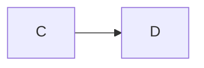

# C3 — Diagram Render Gate Implementation Plan

> **For agentic workers:** REQUIRED SUB-SKILL: Use superpowers:subagent-driven-development (recommended) or superpowers:executing-plans to implement this plan task-by-task. Steps use checkbox (`- [ ]`) syntax for tracking.

**Goal:** Ship a build-time-only, self-validating Playwright gate that proves agent-emitted Mermaid actually renders in the built MkDocs site, blocking merges on any unrendered diagram.

**Architecture:** One CLI module `scripts/verify_diagrams.py` with a **guarded** Playwright import. The pass/fail _verdict_ logic (fence scan, URL mapping, ledger, per-page failure decision) is pure stdlib and always unit-tested; only the DOM _measurement_ (`_assert_page`) and the browser self-test need Chromium and are `pytest.importorskip`-gated. A new `docs.yml` workflow installs Playwright and runs the gate as a required check; `make docs-verify` runs it locally and skips gracefully when Playwright is absent.

**Tech Stack:** Python 3.9+ stdlib (`argparse`, `re`, `http.server`, `threading`, `pathlib`, `json`), Playwright (Chromium) for the browser layer only, MkDocs + Material in docs CI, a vendored pinned `mermaid.min.js` for hermetic render fixtures.

**Spec:** `docs/superpowers/specs/2026-05-26-cce-capability-c3-diagram-render-gate-design.md` (committed `a7caac3`).

**Run tests with:** `python3 -m pytest -q` (local Python 3.9; bare `pytest` may not resolve). Render tests skip locally (no Playwright) and run in `docs.yml`.

---

## File Structure

| File                                                     | Responsibility                                                                                                                                           |
| -------------------------------------------------------- | -------------------------------------------------------------------------------------------------------------------------------------------------------- |
| `scripts/verify_diagrams.py` (create)                    | The gate: pure verdict logic + guarded Playwright browser layer + CLI                                                                                    |
| `tests/diagrams/test_diagram_gate_core.py` (create)      | Pure-logic tests: fence scan, URL mapping, failure decision, ledger (always run)                                                                         |
| `tests/diagrams/test_runtime_isolation.py` (create)      | Asserts the agent runtime never imports `playwright` (always run)                                                                                        |
| `tests/diagrams/test_verify_diagrams_render.py` (create) | Browser tests via `pytest.importorskip("playwright")` (run only where Chromium exists)                                                                   |
| `tests/diagrams/test_cli.py` (create)                    | CLI arg + Playwright-absent behavior (always run; monkeypatches availability)                                                                            |
| `tests/diagrams/test_packaging.py` (create)              | Asserts `requirements-docs.txt`, `Makefile docs-verify`, and `docs.yml` shape (always run)                                                               |
| `tests/fixtures/diagrams/render/` (create)               | `mermaid.min.js` (vendored, pinned), `good.html`, `broken.html`, `blank.html`, `asset404.html`, `count2.html`, and a `src/` mirror for source-scan tests |
| `requirements-docs.txt` (create)                         | Playwright + MkDocs + Material — docs tooling, separate from agent runtime deps                                                                          |
| `Makefile` (create)                                      | `docs-verify` target (build + gate; graceful local skip)                                                                                                 |
| `.github/workflows/docs.yml` (create)                    | The merge-blocking CI gate                                                                                                                               |

The existing `scripts/lint/diagrams.py` (syntactic fence lint) is **left unchanged** — C3 is the additive render layer.

---

## Module contract (shared across tasks — read before starting)

`scripts/verify_diagrams.py` exposes these symbols. Signatures are fixed; later tasks depend on them exactly as written.

```python
# Module-level guarded import (Task 1):
try:
    from playwright.sync_api import sync_playwright  # noqa: F401
    _PLAYWRIGHT_AVAILABLE = True
except ImportError:  # docs-tooling dep, absent in the agent runtime / local dev
    sync_playwright = None
    _PLAYWRIGHT_AVAILABLE = False

# Pure (stdlib) — Tasks 1 & 2:
def scan_mermaid_sources(source_dir: Path) -> dict[str, int]: ...      # {posix_page: fence_count}, count>0 only
def source_to_built_urls(page: str) -> list[str]: ...                  # candidate built rel-paths, both URL layouts
def _page_failure(page: str, expected: int, result: dict) -> dict | None: ...  # one failure dict or None
def build_ledger(self_test: dict, page_results: list[dict]) -> dict: ...
def ledger_ok(ledger: dict) -> bool: ...

# Browser (Playwright) — Task 4:
def _assert_page(page_obj, url: str) -> dict: ...   # {http_status, rendered_ok, error_boxes, asset_errors}
def run_self_test(fixtures_dir: Path) -> dict: ...  # {good, broken, ok}
def verify_site(site_dir: Path, source_dir: Path, fixtures_dir: Path) -> dict:  # full ledger

# CLI — Task 5:
def main(argv: list[str] | None = None) -> int: ...
```

**`result` dict** (produced by `_assert_page`, consumed by `_page_failure`):
`{"http_status": int, "rendered_ok": int, "error_boxes": list[str], "asset_errors": list[str]}`.

**`_page_failure` precedence** (first match wins, deterministic): `page_missing` (http != 200) → `error_box` → `asset_error` → `count_mismatch` (`rendered_ok < expected`) → else `None`.

**Failure dict shape:** `{"page": str, "reason": str, ...detail}` where detail keys are: `page_missing` → `http`; `error_box` → `detail` (first error string); `asset_error` → `detail` (first asset string); `count_mismatch` → `expected`, `rendered`.

**Ledger shape:**

```json
{
  "self_test": {
    "good": "pass|fail|skip",
    "broken": "pass|fail|skip",
    "ok": true
  },
  "checked_pages": 0,
  "expected_diagrams": 0,
  "rendered_diagrams": 0,
  "failures": []
}
```

`ledger_ok` ⇔ `self_test.ok and not failures`.

---

### Task 1: Pure core — fence scanning + URL mapping

**Files:**

- Create: `scripts/verify_diagrams.py`
- Create: `tests/diagrams/test_diagram_gate_core.py`

- [ ] **Step 1: Write the failing tests**

````python
# tests/diagrams/test_diagram_gate_core.py
from __future__ import annotations

import sys
from pathlib import Path

sys.path.insert(0, str(Path(__file__).resolve().parents[2] / "scripts"))
import verify_diagrams as vd  # noqa: E402


def test_scan_counts_mermaid_fences(tmp_path):
    (tmp_path / "core").mkdir()
    (tmp_path / "core" / "api.md").write_text(
        "# API\n\n```mermaid\ngraph TD\nA-->B\n```\n\ntext\n\n```mermaid\nflowchart LR\n```\n"
    )
    (tmp_path / "plain.md").write_text("# Plain\n\n```python\nx = 1\n```\n")
    assert vd.scan_mermaid_sources(tmp_path) == {"core/api.md": 2}


def test_scan_ignores_indented_and_nonmermaid(tmp_path):
    (tmp_path / "a.md").write_text("```mermaid\ngraph TD\n```\n")
    (tmp_path / "b.md").write_text("    ```mermaid\n    graph TD\n    ```\n")  # indented code, not a fence
    assert vd.scan_mermaid_sources(tmp_path) == {"a.md": 1}


def test_scan_empty_dir_is_empty(tmp_path):
    assert vd.scan_mermaid_sources(tmp_path) == {}


def test_scan_missing_dir_is_empty(tmp_path):
    assert vd.scan_mermaid_sources(tmp_path / "nope") == {}


def test_source_to_built_urls_directory_and_flat():
    assert vd.source_to_built_urls("core/api.md") == ["core/api/index.html", "core/api.html"]


def test_source_to_built_urls_index_page():
    assert vd.source_to_built_urls("index.md") == ["index.html"]
    assert vd.source_to_built_urls("core/index.md") == ["core/index.html"]
````

- [ ] **Step 2: Run tests to verify they fail**

Run: `python3 -m pytest tests/diagrams/test_diagram_gate_core.py -q`
Expected: FAIL — `ModuleNotFoundError: No module named 'verify_diagrams'`.

- [ ] **Step 3: Write the minimal implementation**

````python
# scripts/verify_diagrams.py
"""Diagram render gate (capability C3).

Build-time-only gate: proves agent-emitted Mermaid actually renders in the
built MkDocs site. The pass/fail verdict logic (fence scan, URL mapping,
ledger) is pure stdlib and always testable; the DOM measurement and browser
self-test require Playwright (a docs-tooling dependency) and are isolated
behind a guarded import. This module MUST NEVER be imported by the stdlib
agent runtime.
"""

from __future__ import annotations

import argparse
import json
import re
import sys
from pathlib import Path

try:
    from playwright.sync_api import sync_playwright  # noqa: F401
    _PLAYWRIGHT_AVAILABLE = True
except ImportError:  # docs-tooling dep; absent in the agent runtime / local dev
    sync_playwright = None
    _PLAYWRIGHT_AVAILABLE = False

# An opening Mermaid fence at column 0 (mirrors scripts/lint/diagrams.py).
_MERMAID_FENCE = re.compile(r"^```mermaid\s*$", re.MULTILINE)


def scan_mermaid_sources(source_dir: Path) -> dict[str, int]:
    """Map each source page (POSIX path relative to source_dir) to its count
    of opening ``` ```mermaid ``` fences. Pages with no fence are omitted.
    Never raises; unreadable files are skipped.
    """
    out: dict[str, int] = {}
    if not source_dir.is_dir():
        return out
    for md in sorted(source_dir.rglob("*.md")):
        try:
            text = md.read_text(encoding="utf-8", errors="replace")
        except OSError:
            continue
        count = len(_MERMAID_FENCE.findall(text))
        if count:
            out[md.relative_to(source_dir).as_posix()] = count
    return out


def source_to_built_urls(page: str) -> list[str]:
    """Candidate built-site relative paths for a source page, probing both
    MkDocs layouts. ``foo/bar.md`` -> ``[foo/bar/index.html, foo/bar.html]``;
    an ``index.md`` -> its directory's ``index.html``.
    """
    stem = page[:-3] if page.endswith(".md") else page
    name = stem.rsplit("/", 1)[-1]
    if name == "index":
        return [f"{stem}.html"]  # index.md -> index.html ; foo/index.md -> foo/index.html
    return [f"{stem}/index.html", f"{stem}.html"]
````

- [ ] **Step 4: Run tests to verify they pass**

Run: `python3 -m pytest tests/diagrams/test_diagram_gate_core.py -q`
Expected: PASS (6 passed).

- [ ] **Step 5: Commit**

```bash
git add scripts/verify_diagrams.py tests/diagrams/test_diagram_gate_core.py
git commit -m "feat(CCE-30): C3 gate pure core — mermaid fence scan + built-URL mapping

Co-Authored-By: Claude Opus 4.7 <noreply@anthropic.com>"
```

---

### Task 2: Pure core — per-page failure decision + ledger

**Files:**

- Modify: `scripts/verify_diagrams.py`
- Modify: `tests/diagrams/test_diagram_gate_core.py`

- [ ] **Step 1: Write the failing tests** (append)

```python
def _result(http=200, rendered=1, errors=None, assets=None):
    return {"http_status": http, "rendered_ok": rendered,
            "error_boxes": errors or [], "asset_errors": assets or []}


def test_page_failure_ok_returns_none():
    assert vd._page_failure("core/api/", 1, _result(rendered=1)) is None


def test_page_failure_page_missing():
    f = vd._page_failure("core/gone/", 1, _result(http=404, rendered=0))
    assert f == {"page": "core/gone/", "reason": "page_missing", "http": 404}


def test_page_failure_error_box_beats_count():
    f = vd._page_failure("core/api/", 2, _result(rendered=1, errors=["Syntax error in text"]))
    assert f["reason"] == "error_box"
    assert f["detail"] == "Syntax error in text"


def test_page_failure_asset_error():
    f = vd._page_failure("g/setup/", 1, _result(rendered=1, assets=["main.css 404"]))
    assert f["reason"] == "asset_error"
    assert f["detail"] == "main.css 404"


def test_page_failure_count_mismatch():
    f = vd._page_failure("core/api/", 2, _result(rendered=1))
    assert f == {"page": "core/api/", "reason": "count_mismatch", "expected": 2, "rendered": 1}


def test_build_ledger_and_ok():
    ledger = vd.build_ledger(
        {"good": "pass", "broken": "fail", "ok": True},
        [{"page": "core/api/", "expected": 2, "rendered_ok": 2, "failure": None},
         {"page": "g/x/", "expected": 1, "rendered_ok": 0,
          "failure": {"page": "g/x/", "reason": "count_mismatch", "expected": 1, "rendered": 0}}],
    )
    assert ledger["checked_pages"] == 2
    assert ledger["expected_diagrams"] == 3
    assert ledger["rendered_diagrams"] == 2
    assert len(ledger["failures"]) == 1
    assert vd.ledger_ok(ledger) is False


def test_ledger_ok_true_when_clean_and_selftest_ok():
    ledger = vd.build_ledger({"good": "pass", "broken": "fail", "ok": True}, [])
    assert vd.ledger_ok(ledger) is True


def test_ledger_not_ok_when_selftest_failed():
    ledger = vd.build_ledger({"good": "pass", "broken": "pass", "ok": False}, [])
    assert vd.ledger_ok(ledger) is False
```

- [ ] **Step 2: Run to verify failure**

Run: `python3 -m pytest tests/diagrams/test_diagram_gate_core.py -q`
Expected: FAIL — `AttributeError: module 'verify_diagrams' has no attribute '_page_failure'`.

- [ ] **Step 3: Implement** (append to `scripts/verify_diagrams.py`, after `source_to_built_urls`)

```python
def _page_failure(page: str, expected: int, result: dict) -> dict | None:
    """Decide the single failure for one page from its measured result, or
    None if the page is clean. Precedence (first match wins): page_missing ->
    error_box -> asset_error -> count_mismatch. Pure; never raises.
    """
    if result.get("http_status") != 200:
        return {"page": page, "reason": "page_missing", "http": result.get("http_status")}
    errors = result.get("error_boxes") or []
    if errors:
        return {"page": page, "reason": "error_box", "detail": errors[0]}
    assets = result.get("asset_errors") or []
    if assets:
        return {"page": page, "reason": "asset_error", "detail": assets[0]}
    rendered = int(result.get("rendered_ok") or 0)
    if rendered < expected:
        return {"page": page, "reason": "count_mismatch", "expected": expected, "rendered": rendered}
    return None


def build_ledger(self_test: dict, page_results: list[dict]) -> dict:
    """Assemble the JSON ledger from the self-test outcome and per-page results.
    Each page_result is {page, expected, rendered_ok, failure(dict|None)}.
    """
    failures = [r["failure"] for r in page_results if r.get("failure")]
    return {
        "self_test": self_test,
        "checked_pages": len(page_results),
        "expected_diagrams": sum(int(r.get("expected") or 0) for r in page_results),
        "rendered_diagrams": sum(int(r.get("rendered_ok") or 0) for r in page_results),
        "failures": failures,
    }


def ledger_ok(ledger: dict) -> bool:
    """The gate passes iff the self-test held and no page failed."""
    return bool(ledger.get("self_test", {}).get("ok")) and not ledger.get("failures")
```

- [ ] **Step 4: Run to verify pass**

Run: `python3 -m pytest tests/diagrams/test_diagram_gate_core.py -q`
Expected: PASS (14 passed).

- [ ] **Step 5: Commit**

```bash
git add scripts/verify_diagrams.py tests/diagrams/test_diagram_gate_core.py
git commit -m "feat(CCE-30): C3 gate verdict logic — per-page failure decision + ledger

Co-Authored-By: Claude Opus 4.7 <noreply@anthropic.com>"
```

---

### Task 3: Runtime isolation test

Pin the hard constraint: the stdlib agent runtime must never import Playwright, and `verify_diagrams` must be importable without it.

**Files:**

- Create: `tests/diagrams/test_runtime_isolation.py`

- [ ] **Step 1: Write the failing test**

```python
# tests/diagrams/test_runtime_isolation.py
from __future__ import annotations

import subprocess
import sys
from pathlib import Path

SCRIPTS = Path(__file__).resolve().parents[2] / "scripts"


def test_agent_runtime_does_not_import_playwright():
    """Importing the orchestrator entrypoint must not drag Playwright (a
    docs-tooling dep) into the stdlib agent runtime."""
    code = (
        "import sys; sys.path.insert(0, %r);"
        "import orchestrator_runner;"
        "assert 'playwright' not in sys.modules, 'agent runtime imported playwright';"
        "print('clean')" % str(SCRIPTS)
    )
    r = subprocess.run([sys.executable, "-c", code], capture_output=True, text=True)
    assert r.returncode == 0, r.stderr
    assert "clean" in r.stdout


def test_verify_diagrams_imports_without_playwright():
    """The gate module imports even when Playwright is absent; the guard sets
    _PLAYWRIGHT_AVAILABLE rather than crashing at import."""
    code = (
        "import sys; sys.path.insert(0, %r);"
        "import verify_diagrams as vd;"
        "assert hasattr(vd, '_PLAYWRIGHT_AVAILABLE');"
        "assert vd.scan_mermaid_sources.__module__ == 'verify_diagrams';"
        "print('ok')" % str(SCRIPTS)
    )
    r = subprocess.run([sys.executable, "-c", code], capture_output=True, text=True)
    assert r.returncode == 0, r.stderr
    assert "ok" in r.stdout
```

- [ ] **Step 2: Run to verify it passes immediately** (this is a guard test — it should pass against Task 1/2 code; if it FAILS, the isolation constraint is genuinely violated and must be fixed in `verify_diagrams.py`, not the test)

Run: `python3 -m pytest tests/diagrams/test_runtime_isolation.py -q`
Expected: PASS (2 passed). If `test_agent_runtime_does_not_import_playwright` fails, some agent-runtime module imports `verify_diagrams` — remove that import.

- [ ] **Step 3: Commit**

```bash
git add tests/diagrams/test_runtime_isolation.py
git commit -m "test(CCE-30): pin runtime isolation — agent runtime never imports playwright

Co-Authored-By: Claude Opus 4.7 <noreply@anthropic.com>"
```

---

### Task 4: Browser layer — render fixtures, per-page assertion, self-test, verify_site

**Files:**

- Modify: `scripts/verify_diagrams.py`
- Create: `tests/fixtures/diagrams/render/mermaid.min.js` (vendored, pinned)
- Create: `tests/fixtures/diagrams/render/{good,broken,blank,asset404,count2}.html`
- Create: `tests/fixtures/diagrams/render/src/{good,count2}.md` (source mirror for scan tests)
- Create: `tests/diagrams/test_verify_diagrams_render.py`

- [ ] **Step 1: Vendor the pinned Mermaid bundle**

```bash
mkdir -p tests/fixtures/diagrams/render/src
curl -fsSL https://cdn.jsdelivr.net/npm/mermaid@11.4.1/dist/mermaid.min.js \
  -o tests/fixtures/diagrams/render/mermaid.min.js
test -s tests/fixtures/diagrams/render/mermaid.min.js && echo "vendored mermaid OK"
```

(If 11.4.1 404s, use the latest `mermaid@11` patch; record the exact version in a one-line comment at the top of `good.html`. The render path must use a real Mermaid so `broken.html` exercises the genuine error box.)

- [ ] **Step 2: Write the fixtures**

`tests/fixtures/diagrams/render/good.html` — one valid diagram (renders to a real `<svg>`):

```html
<!doctype html><meta charset="utf-8" /><!-- mermaid@11.4.1 -->
<div class="mermaid">graph TD; A--&gt;B; B--&gt;C;</div>
<script src="mermaid.min.js"></script>
<script>
  mermaid.initialize({ startOnLoad: true });
</script>
```

`tests/fixtures/diagrams/render/broken.html` — invalid Mermaid → real error box:

```html
<!doctype html><meta charset="utf-8" />
<div class="mermaid">graph TD; A--&gt; ((( this is not valid mermaid</div>
<script src="mermaid.min.js"></script>
<script>
  mermaid.initialize({ startOnLoad: true });
</script>
```

`tests/fixtures/diagrams/render/blank.html` — a `.mermaid` that never renders (no script):

```html
<!doctype html><meta charset="utf-8" />
<div class="mermaid">graph TD; A--&gt;B;</div>
```

`tests/fixtures/diagrams/render/asset404.html` — valid diagram but a missing local asset:

```html
<!doctype html><meta charset="utf-8" />
<link rel="stylesheet" href="missing.css" />
<div class="mermaid">graph TD; A--&gt;B;</div>
<script src="mermaid.min.js"></script>
<script>
  mermaid.initialize({ startOnLoad: true });
</script>
```

`tests/fixtures/diagrams/render/count2.html` — page that renders ONE diagram but source declares TWO:

```html
<!doctype html><meta charset="utf-8" />
<div class="mermaid">graph TD; A--&gt;B;</div>
<script src="mermaid.min.js"></script>
<script>
  mermaid.initialize({ startOnLoad: true });
</script>
```

Source mirror (for `verify_site` scan → built-URL mapping in tests). Built URLs are flat `*.html` here, so name sources to map onto them:
`tests/fixtures/diagrams/render/src/good.md`:

````markdown
# Good


````

`tests/fixtures/diagrams/render/src/count2.md` (declares TWO fences; built page renders one → count_mismatch):

````markdown
# Count two



````

- [ ] **Step 3: Write the failing render tests**

```python
# tests/diagrams/test_verify_diagrams_render.py
from __future__ import annotations

import sys
from pathlib import Path

import pytest

pytest.importorskip("playwright")  # browser layer — skipped where Chromium is absent

sys.path.insert(0, str(Path(__file__).resolve().parents[2] / "scripts"))
import verify_diagrams as vd  # noqa: E402

FIX = Path(__file__).resolve().parents[1] / "fixtures" / "diagrams" / "render"


def test_self_test_handshake_holds():
    st = vd.run_self_test(FIX)
    assert st == {"good": "pass", "broken": "fail", "ok": True}


def test_verify_site_passes_for_good_only(tmp_path):
    # A site + source where the only page is good.html / good.md.
    site = tmp_path / "site"; site.mkdir()
    (site / "good.html").write_text((FIX / "good.html").read_text())
    (site / "mermaid.min.js").write_text((FIX / "mermaid.min.js").read_text())
    src = tmp_path / "src"; src.mkdir()
    (src / "good.md").write_text((FIX / "src" / "good.md").read_text())
    ledger = vd.verify_site(site, src, FIX)
    assert ledger["failures"] == []
    assert vd.ledger_ok(ledger) is True


def test_verify_site_flags_count_mismatch(tmp_path):
    site = tmp_path / "site"; site.mkdir()
    (site / "count2.html").write_text((FIX / "count2.html").read_text())
    (site / "mermaid.min.js").write_text((FIX / "mermaid.min.js").read_text())
    src = tmp_path / "src"; src.mkdir()
    (src / "count2.md").write_text((FIX / "src" / "count2.md").read_text())
    ledger = vd.verify_site(site, src, FIX)
    reasons = [f["reason"] for f in ledger["failures"]]
    assert "count_mismatch" in reasons


def test_assert_page_detects_error_box():
    # Drive a single fixture page directly through the browser layer.
    result = vd._render_one(FIX, "broken.html")
    assert result["error_boxes"], "broken mermaid must surface an error box"
```

- [ ] **Step 4: Run to verify failure**

Run: `python3 -m pytest tests/diagrams/test_verify_diagrams_render.py -q`
Expected (local, no Playwright): `s` / "skipped" — `importorskip` skips the module. To actually drive these, run where Playwright+Chromium are installed (docs CI). When run with Playwright present and no implementation yet: FAIL — `AttributeError: ... 'run_self_test'`.

- [ ] **Step 5: Implement the browser layer** (append to `scripts/verify_diagrams.py`)

```python
import threading
from contextlib import contextmanager
from functools import partial
from http.server import SimpleHTTPRequestHandler, ThreadingHTTPServer

# In-page measurement: per .mermaid element, does it carry a real <svg> with
# non-zero geometry and NO Mermaid error signature? Returns one dict per element.
_MEASURE_JS = r"""
() => {
  const els = Array.from(document.querySelectorAll('.mermaid, pre.mermaid'));
  return els.map(el => {
    const svg = el.querySelector('svg');
    const box = svg ? svg.getBoundingClientRect() : {width: 0, height: 0};
    const txt = (el.textContent || '');
    const hasError =
      /syntax error/i.test(txt) ||
      el.querySelector('[class*="error"]') !== null ||
      (svg && /error/i.test(svg.getAttribute('aria-roledescription') || ''));
    return { hasSvg: !!svg, w: box.width, h: box.height, hasError };
  });
}
"""


@contextmanager
def _serve(site_dir: Path):
    """Serve site_dir on an ephemeral localhost port for the duration of the
    context. Yields the base URL (http://127.0.0.1:<port>)."""
    handler = partial(SimpleHTTPRequestHandler, directory=str(site_dir))
    httpd = ThreadingHTTPServer(("127.0.0.1", 0), handler)
    thread = threading.Thread(target=httpd.serve_forever, daemon=True)
    thread.start()
    try:
        yield f"http://127.0.0.1:{httpd.server_address[1]}"
    finally:
        httpd.shutdown()
        thread.join(timeout=5)


def _assert_page(page_obj, url: str) -> dict:
    """Load url, wait for Mermaid to settle, and measure every .mermaid element.
    Captures same-origin 4xx/5xx responses as asset errors."""
    asset_errors: list[str] = []
    base = url.rsplit("/", 1)[0] if url.count("/") > 2 else url

    def _on_response(resp):
        if resp.status >= 400 and resp.url.startswith("http://127.0.0.1"):
            name = resp.url.rsplit("/", 1)[-1] or resp.url
            asset_errors.append(f"{name} {resp.status}")

    page_obj.on("response", _on_response)
    resp = page_obj.goto(url, wait_until="load")
    http_status = resp.status if resp else 0
    # Give Mermaid time to render (or to inject its error box).
    page_obj.wait_for_timeout(1500)
    measured = page_obj.evaluate(_MEASURE_JS)
    page_obj.remove_listener("response", _on_response)
    rendered_ok = sum(1 for m in measured if m["hasSvg"] and m["w"] > 0 and m["h"] > 0 and not m["hasError"])
    error_boxes = []
    for m in measured:
        if m["hasError"]:
            error_boxes.append("Syntax error in text")
    return {
        "http_status": http_status,
        "rendered_ok": rendered_ok,
        "error_boxes": error_boxes,
        "asset_errors": asset_errors,
    }


@contextmanager
def _browser_page(site_dir: Path):
    """Yield (base_url, page) with a Chromium page bound to a server for site_dir."""
    with _serve(site_dir) as base_url, sync_playwright() as p:
        browser = p.chromium.launch()
        try:
            yield base_url, browser.new_page()
        finally:
            browser.close()


def _render_one(site_dir: Path, rel_url: str) -> dict:
    """Convenience: measure a single page (used by run_self_test and tests)."""
    with _browser_page(site_dir) as (base_url, page):
        return _assert_page(page, f"{base_url}/{rel_url}")


def run_self_test(fixtures_dir: Path) -> dict:
    """Phase A handshake: the known-good fixture must PASS and the known-broken
    fixture must FAIL through the very assertion path the real site uses. If the
    invariant does not hold (esp. broken passing), ok=False and the gate refuses
    to certify the site."""
    if not _PLAYWRIGHT_AVAILABLE:
        return {"good": "skip", "broken": "skip", "ok": False}
    good = _render_one(fixtures_dir, "good.html")
    broken = _render_one(fixtures_dir, "broken.html")
    good_pass = _page_failure("good.html", 1, good) is None
    broken_fail = _page_failure("broken.html", 1, broken) is not None
    return {
        "good": "pass" if good_pass else "fail",
        "broken": "fail" if broken_fail else "pass",
        "ok": good_pass and broken_fail,
    }


def verify_site(site_dir: Path, source_dir: Path, fixtures_dir: Path) -> dict:
    """Full gate: Phase A self-test handshake, then Phase B per-page verification
    of every source page that declares a Mermaid fence."""
    self_test = run_self_test(fixtures_dir)
    expected = scan_mermaid_sources(source_dir)
    page_results: list[dict] = []
    if expected:
        with _browser_page(site_dir) as (base_url, page):
            for src_page, count in sorted(expected.items()):
                candidates = source_to_built_urls(src_page)
                result = {"http_status": 0, "rendered_ok": 0, "error_boxes": [], "asset_errors": []}
                for rel in candidates:  # probe both URL layouts; first 200 wins
                    result = _assert_page(page, f"{base_url}/{rel}")
                    if result["http_status"] == 200:
                        break
                page_results.append({
                    "page": src_page,
                    "expected": count,
                    "rendered_ok": result["rendered_ok"],
                    "failure": _page_failure(src_page, count, result),
                })
    return build_ledger(self_test, page_results)
```

- [ ] **Step 6: Run the render tests where Playwright exists**

Run (in an env with Playwright + Chromium): `python3 -m pytest tests/diagrams/test_verify_diagrams_render.py -q`
Expected: PASS (4 passed). Locally without Playwright: the module is skipped — confirm with `python3 -m pytest tests/diagrams/test_verify_diagrams_render.py -q` showing `1 skipped` (collection skip) or all-skipped.

- [ ] **Step 7: Commit**

```bash
git add scripts/verify_diagrams.py tests/diagrams/test_verify_diagrams_render.py tests/fixtures/diagrams/render
git commit -m "feat(CCE-30): C3 browser layer — self-test handshake + per-page render assertion

Co-Authored-By: Claude Opus 4.7 <noreply@anthropic.com>"
```

---

### Task 5: CLI `main()` — args + Playwright-absent handling

**Files:**

- Modify: `scripts/verify_diagrams.py`
- Create: `tests/diagrams/test_cli.py`

- [ ] **Step 1: Write the failing tests**

```python
# tests/diagrams/test_cli.py
from __future__ import annotations

import sys
from pathlib import Path

sys.path.insert(0, str(Path(__file__).resolve().parents[2] / "scripts"))
import verify_diagrams as vd  # noqa: E402


def test_main_skips_gracefully_when_playwright_absent(monkeypatch, tmp_path, capsys):
    monkeypatch.setattr(vd, "_PLAYWRIGHT_AVAILABLE", False)
    site = tmp_path / "site"; site.mkdir()
    src = tmp_path / "src"; src.mkdir()
    rc = vd.main(["--site-dir", str(site), "--source-dir", str(src)])
    assert rc == 0
    assert "diagram gate unavailable" in capsys.readouterr().out.lower()


def test_main_require_hard_fails_when_playwright_absent(monkeypatch, tmp_path):
    monkeypatch.setattr(vd, "_PLAYWRIGHT_AVAILABLE", False)
    site = tmp_path / "site"; site.mkdir()
    src = tmp_path / "src"; src.mkdir()
    rc = vd.main(["--site-dir", str(site), "--source-dir", str(src), "--require"])
    assert rc != 0


def test_main_self_test_only_requires_playwright(monkeypatch, tmp_path):
    # Without Playwright and without --require, --self-test-only also skips clean.
    monkeypatch.setattr(vd, "_PLAYWRIGHT_AVAILABLE", False)
    rc = vd.main(["--site-dir", str(tmp_path), "--source-dir", str(tmp_path), "--self-test-only"])
    assert rc == 0
```

- [ ] **Step 2: Run to verify failure**

Run: `python3 -m pytest tests/diagrams/test_cli.py -q`
Expected: FAIL — `AttributeError: module 'verify_diagrams' has no attribute 'main'`.

- [ ] **Step 3: Implement** (append to `scripts/verify_diagrams.py`)

```python
_FIXTURES_DIR = Path(__file__).resolve().parents[1] / "tests" / "fixtures" / "diagrams" / "render"


def main(argv: list[str] | None = None) -> int:
    ap = argparse.ArgumentParser(description="Verify Mermaid diagrams render in the built site.")
    ap.add_argument("--site-dir", type=Path, required=True, help="built MkDocs site")
    ap.add_argument("--source-dir", type=Path, required=True, help="docs source scanned for fences")
    ap.add_argument("--fixtures-dir", type=Path, default=_FIXTURES_DIR, help="self-test fixtures")
    ap.add_argument("--self-test-only", action="store_true", help="run only the Phase A handshake")
    ap.add_argument("--require", action="store_true",
                    help="hard-fail if Playwright is unavailable (CI sets this)")
    ap.add_argument("--json", action="store_true", help="emit the full JSON ledger")
    args = ap.parse_args(argv)

    if not _PLAYWRIGHT_AVAILABLE:
        msg = ("diagram gate unavailable: install docs tooling with "
               "`pip install -r requirements-docs.txt && playwright install chromium`")
        if args.require:
            print(msg, file=sys.stderr)
            return 2
        print(msg)  # local convenience: skip, not fail
        return 0

    if args.self_test_only:
        st = run_self_test(args.fixtures_dir)
        print(json.dumps({"self_test": st}, indent=2) if args.json else f"self_test={st}")
        return 0 if st["ok"] else 1

    ledger = verify_site(args.site_dir, args.source_dir, args.fixtures_dir)
    if args.json:
        print(json.dumps(ledger, indent=2))
    else:
        print(f"self_test_ok={ledger['self_test']['ok']} "
              f"pages={ledger['checked_pages']} expected={ledger['expected_diagrams']} "
              f"rendered={ledger['rendered_diagrams']} failures={len(ledger['failures'])}")
    return 0 if ledger_ok(ledger) else 1


if __name__ == "__main__":
    raise SystemExit(main())
```

- [ ] **Step 4: Run to verify pass**

Run: `python3 -m pytest tests/diagrams/test_cli.py -q`
Expected: PASS (3 passed).

- [ ] **Step 5: Commit**

```bash
git add scripts/verify_diagrams.py tests/diagrams/test_cli.py
git commit -m "feat(CCE-30): C3 CLI — args, self-test-only, require/skip on playwright absence

Co-Authored-By: Claude Opus 4.7 <noreply@anthropic.com>"
```

---

### Task 6: Docs-tooling deps + `make docs-verify`

**Files:**

- Create: `requirements-docs.txt`
- Create: `Makefile`
- Create: `tests/diagrams/test_packaging.py`

- [ ] **Step 1: Write the failing tests**

```python
# tests/diagrams/test_packaging.py
from __future__ import annotations

from pathlib import Path

ROOT = Path(__file__).resolve().parents[2]


def test_requirements_docs_declares_playwright_and_mkdocs():
    txt = (ROOT / "requirements-docs.txt").read_text().lower()
    assert "playwright" in txt
    assert "mkdocs" in txt  # building the site is part of the gate's CI job


def test_requirements_docs_separate_from_agent_runtime():
    # The agent runtime stays stdlib + pyyaml + jsonschema; playwright must not
    # leak into a general requirements.txt if one exists.
    rt = ROOT / "requirements.txt"
    if rt.exists():
        assert "playwright" not in rt.read_text().lower()


def test_makefile_has_docs_verify_target():
    mk = (ROOT / "Makefile").read_text()
    assert "docs-verify:" in mk
    assert "verify_diagrams.py" in mk
```

- [ ] **Step 2: Run to verify failure**

Run: `python3 -m pytest tests/diagrams/test_packaging.py -q`
Expected: FAIL — `FileNotFoundError: requirements-docs.txt`.

- [ ] **Step 3: Create `requirements-docs.txt`**

```text
# Docs-tooling dependencies — build + verify the docs site.
# SEPARATE from the agent runtime (stdlib + pyyaml + jsonschema). Never merge
# these into the agent runtime requirements; Playwright must not enter that path.
playwright==1.49.1
mkdocs==1.6.1
mkdocs-material==9.5.49
```

(If a pinned version is unavailable at install time, bump to the nearest available patch and note it in the same comment block.)

- [ ] **Step 4: Create `Makefile`**

```makefile
# Docs build + diagram render gate. Local convenience; CI uses docs.yml.
DOCS_DIR ?= docs/site-src
SITE_DIR ?= site

.PHONY: docs-verify
docs-verify:
	@python3 -c "import playwright" 2>/dev/null || { \
	  echo "diagram gate unavailable: pip install -r requirements-docs.txt && playwright install chromium"; \
	  exit 0; }
	mkdocs build --strict
	python3 scripts/verify_diagrams.py --site-dir $(SITE_DIR) --source-dir $(DOCS_DIR) --json
```

- [ ] **Step 5: Run to verify pass**

Run: `python3 -m pytest tests/diagrams/test_packaging.py -q`
Expected: PASS (3 passed).

- [ ] **Step 6: Commit**

```bash
git add requirements-docs.txt Makefile tests/diagrams/test_packaging.py
git commit -m "feat(CCE-30): docs-tooling deps + make docs-verify (graceful local skip)

Co-Authored-By: Claude Opus 4.7 <noreply@anthropic.com>"
```

---

### Task 7: `.github/workflows/docs.yml` — the merge-blocking gate

**Files:**

- Create: `.github/workflows/docs.yml`
- Modify: `tests/diagrams/test_packaging.py`

- [ ] **Step 1: Write the failing test** (append to `test_packaging.py`)

```python
def test_docs_workflow_runs_the_gate():
    import yaml  # already a runtime dep

    wf = ROOT / ".github" / "workflows" / "docs.yml"
    data = yaml.safe_load(wf.read_text())
    # `on:` may parse as the boolean True key in YAML 1.1 — accept either.
    triggers = data.get("on") or data.get(True)
    assert triggers, "workflow must declare triggers"
    body = wf.read_text()
    assert "playwright install" in body
    assert "verify_diagrams.py" in body
    assert "--require" in body  # CI must hard-fail when Playwright is missing
    assert "mkdocs build" in body
    # Scoped to docs / gate files, not every push.
    assert "paths:" in body
```

- [ ] **Step 2: Run to verify failure**

Run: `python3 -m pytest tests/diagrams/test_packaging.py::test_docs_workflow_runs_the_gate -q`
Expected: FAIL — `FileNotFoundError: docs.yml`.

- [ ] **Step 3: Create `.github/workflows/docs.yml`**

```yaml
name: docs

on:
  push:
    branches: [main]
    paths:
      - "docs/**"
      - "scripts/verify_diagrams.py"
      - "tests/diagrams/**"
      - "tests/fixtures/diagrams/render/**"
      - "requirements-docs.txt"
      - ".github/workflows/docs.yml"
  pull_request:
    branches: [main]
    paths:
      - "docs/**"
      - "scripts/verify_diagrams.py"
      - "tests/diagrams/**"
      - "tests/fixtures/diagrams/render/**"
      - "requirements-docs.txt"
      - ".github/workflows/docs.yml"

jobs:
  diagram-gate:
    runs-on: ubuntu-latest
    timeout-minutes: 15
    steps:
      - uses: actions/checkout@v4
      - name: Set up Python
        uses: actions/setup-python@v5
        with:
          python-version: "3.12"
      - name: Install docs tooling
        run: |
          python -m pip install --upgrade pip
          python -m pip install -r requirements-docs.txt pytest pyyaml
      - name: Install Chromium for Playwright
        run: python -m playwright install --with-deps chromium
      - name: Run diagram render tests (Playwright now present)
        run: python -m pytest tests/diagrams -q
      - name: Build the docs site
        run: mkdocs build --strict
      - name: Diagram render gate (required)
        # --require => a missing Playwright here is a HARD failure, never a skip.
        run: python scripts/verify_diagrams.py --site-dir site --source-dir docs/site-src --require --json
```

(If this repo's `mkdocs.yml` lives elsewhere or `docs_dir` differs, align `--source-dir` and the build with the host config; `docs/site-src` matches this repo's dogfood layout.)

- [ ] **Step 4: Run to verify pass**

Run: `python3 -m pytest tests/diagrams/test_packaging.py -q`
Expected: PASS (4 passed).

- [ ] **Step 5: Commit**

```bash
git add .github/workflows/docs.yml tests/diagrams/test_packaging.py
git commit -m "feat(CCE-30): docs.yml — required Playwright diagram render gate on docs changes

Co-Authored-By: Claude Opus 4.7 <noreply@anthropic.com>"
```

---

### Task 8: Full-suite verification

**Files:** none (verification only)

- [ ] **Step 1: Run the whole suite**

Run: `python3 -m pytest -q`
Expected: all prior tests still pass; the new `tests/diagrams/` pure-logic, isolation, CLI, and packaging tests pass; the render module shows as skipped (no local Playwright). No failures, no errors.

- [ ] **Step 2: Confirm isolation holds repo-wide**

Run: `grep -rn "import verify_diagrams" scripts/ agents/ | grep -v "tests/"`
Expected: no matches (only tests import the gate; the agent runtime never does).

- [ ] **Step 3: Sanity-check the CLI skip path locally**

Run: `python3 scripts/verify_diagrams.py --site-dir site --source-dir docs/site-src`
Expected (no local Playwright): prints `diagram gate unavailable: ...` and exits 0.

---

## Self-Review

**Spec coverage:**

- Self-validating handshake (good→pass / broken→fail, refuse-to-certify) → Task 4 `run_self_test` + Task 4 test + ledger `self_test.ok` gate in `ledger_ok`. ✅
- Reject Mermaid error box, not just element presence → `_MEASURE_JS` `hasError` + `_page_failure` `error_box` precedence (Tasks 2, 4). ✅
- Required in CI / skip locally; hard-fail on missing Playwright in CI → Task 5 `--require` + Task 7 `docs.yml --require`; Task 6 Makefile skip. ✅
- Source-scan + build cross-check (count ≥ expected; page_missing; asset 4xx/5xx) → Tasks 1, 2, 4. ✅
- Runtime isolation (gate never in agent runtime; guarded import; dedicated requirements) → Task 3, Task 6, module guard. ✅
- Generic via `--site-dir`/`--source-dir`; no-mermaid trivially passes → Tasks 1, 5 (`expected` empty → no page loads → clean ledger). ✅
- Complements existing `scripts/lint/diagrams.py` → left unchanged (noted, Task list). ✅

**Placeholder scan:** No TBD/TODO. Version pins and `docs/site-src` carry explicit "if it differs, align" notes rather than vague hand-waving. ✅

**Type consistency:** `result` dict keys (`http_status`, `rendered_ok`, `error_boxes`, `asset_errors`) identical across `_assert_page`, `_page_failure`, and tests. `page_result` keys (`page`, `expected`, `rendered_ok`, `failure`) identical across `verify_site`, `build_ledger`, and tests. `self_test` keys (`good`, `broken`, `ok`) identical across `run_self_test`, `build_ledger`, `ledger_ok`, CLI. ✅

---

## Execution coda

Execute via **superpowers:subagent-driven-development**: fresh implementer per task + two-stage review (spec compliance, then code quality). Tasks 1, 2, 5, 6 are mechanical (cheap model); Tasks 3, 4, 7 carry judgment (standard model — Task 4 is the browser layer and warrants the most care). After all tasks, dispatch a **final whole-branch review** (opus).

Then **/ship** (base `main`): test → verify-agent → simplify → code-review → commit → push → PR → Jira (CCE-30). Per the standing authorization, **auto-merge if the integrated suite and CI are green** — including the new `docs.yml` gate, whose first real run validates the browser layer end-to-end. If `docs.yml` (or any check) is red, STOP and surface it rather than merging. On a green merge: post the CCE-30 merge-confirmation comment, delete the branch, and transition CCE-30 → Done (completing Capability C).
